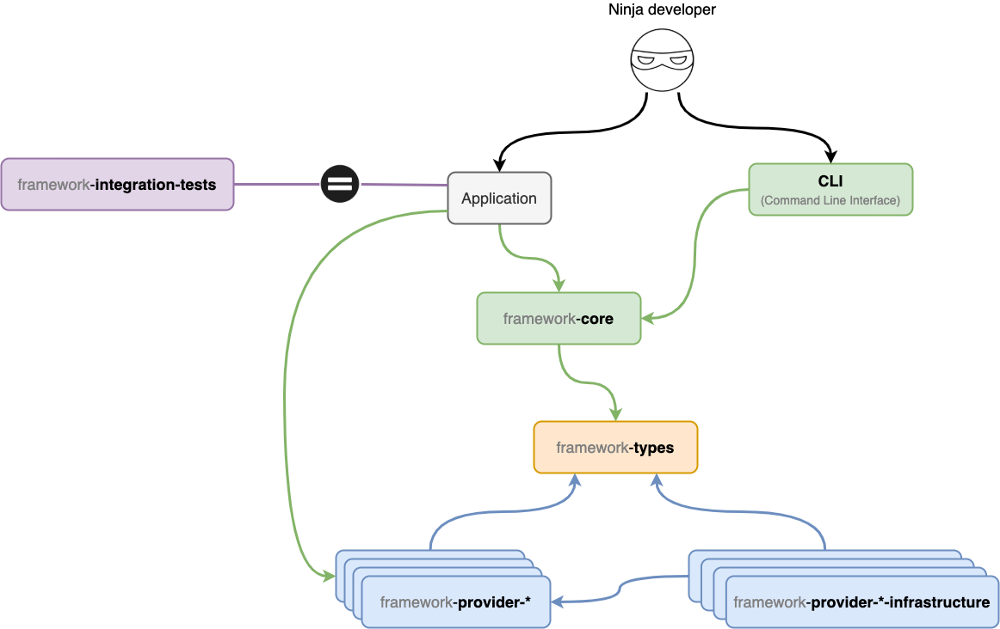

# Contributing to Booster

Thanks for taking the time to contribute to Booster. It is an open-source project and it wouldn't be possible without people like you 🙏🎉

This document is a set of guidelines to help you contribute to Booster, which is hosted on the [`boostercloud`](https://github.com/boostercloud) GitHub
organization. These aren’t absolute laws, use your judgment and common sense 😀.
Remember that if something here doesn't make sense, you can also propose a change to this document.

<!-- toc -->

- [Code of Conduct](#code-of-conduct)
- [I don't want to read this whole thing, I just have a question!!!](#i-dont-want-to-read-this-whole-thing-i-just-have-a-question)
- [What should I know before I get started?](#what-should-i-know-before-i-get-started)
  - [Packages](#packages)
- [How Can I Contribute?](#how-can-i-contribute)
  - [Reporting Bugs](#reporting-bugs)
  - [Suggesting Enhancements](#suggesting-enhancements)
  - [Improving documentation](#improving-documentation)
  - [Create your very first GitHub issue](#create-your-very-first-github-issue)
- [Your First Code Contribution](#your-first-code-contribution)
  - [Getting the code](#getting-the-code)
  - [Understanding the "lerna monorepo" approach and how dependencies are structured in the project](#understanding-the-lerna-monorepo-approach-and-how-dependencies-are-structured-in-the-project)
  - [Running unit tests](#running-unit-tests)
  - [Running integration tests](#running-integration-tests)
  - [Github flow](#github-flow)
  - [Publishing your Pull Request](#publishing-your-pull-request)
  - [Branch naming conventions](#branch-naming-conventions)
  - [Commit message guidelines](#commit-message-guidelines)
- [Code Style Guidelines](#code-style-guidelines)
  - [Importing other files and libraries](#importing-other-files-and-libraries)
  - [Functional style](#functional-style)
  - [Use `const` and `let`](#use-const-and-let)

<!-- tocstop -->

## Code of Conduct

This project and everyone participating in it are expected to uphold the [Berlin Code of Conduct](https://berlincodeofconduct.org).
If you see unacceptable behavior, please communicate so to `hello@booster.cloud`.

## I don't want to read this whole thing, I just have a question!!!

Go ahead and ask the community in [Discord](https://discord.com/invite/bDY8MKx) or [create a new issue](https://github.com/boostercloud/booster/issues).

## What should I know before I get started?

### Packages

Booster is divided in many different packages. The criteria to split the code in packages is that each package meets at least one of the following conditions:

- They must be run separately, for instance, the CLI is run locally, while the support code for the project is run on the cloud.
- They contain code that is used by at least two of the other packages.
- They're a vendor-specific specialization of some abstract part of the framework (for instance, all the code that is required by AWS is in separate packages).

The packages are managed using [Lerna](https://lerna.js.org) and [npm](https://npmjs.com), if you run `lerna run compile`, it will run `npm run compile` in all the package folders.

The packages are published to `npm` under the prefix `@boostercloud/`, their purpose is as follows:

- `cli` - You guessed it! This package is the `boost` command-line tool, it interacts only with the core package in order to load the project configuration. The specific provider packages to interact with the cloud providers are loaded dynamically from the project config.
- `framework-core` - This one contains all the framework runtime vendor-independent logic. Stuff like the generation of the config or the commands and events handling happens here. The specific provider packages to interact with the cloud providers are loaded dynamically from the project config.
- `framework-integration-tests` - Implements integration tests for all supported vendors. Tests are run on real infrastructure using the same mechanisms than a production application. This package `src` folder includes a synthetic Booster application that can be deployed to a real provider for testing purposes.
- `framework-provider-aws` - Implements all the required adapters to make the booster core run on top of AWS technologies like Lambda and DynamoDB using the AWS SDK under the hoods.
- `framework-provider-aws-infrastructure` - Implements all the required adapters to allow Booster applications to be deployed to AWS using the AWS CDK under the hoods.
- `framework-provider-local` - Implements all the required adapters to run the Booster application on a local express server to be able to debug your code before deploying it to a real cloud provider.
- `framework-provider-local-infrastructure` - Implements all the required code to run the local development server.
- `framework-types` - This package defines types that the rest of the project will use. This is useful for avoiding cyclic dependencies. Note that this package should not contain stuff that are not types, or very simple methods related directly to them, i.e. a getter or setter. This package defines the main booster concepts like:
  - Entity
  - Command
  - etc…

This is a dependency graph that shows the dependencies among all packages, including the application using Booster:


## How Can I Contribute?

Contributing to an open source project is never just a matter of code, you can help us significantly by just using Booster and interacting with our community. Here you'll find some tips on how to do it effectively.

### Reporting Bugs

Before creating a bug report, please search for similar issues to make sure that they're not already reported. If you don't find any, go ahead and create an issue including as many details as possible. Fill out the required template, the information requested helps us to resolve issues faster.

Note: If you find a Closed issue that seems related to the issues that you're experiencing, make sure to reference it in the body of your new one by writing its number like this => #42 (Github will autolink it for you).

Bugs are tracked as GitHub issues. Explain the problem and include additional details to help maintainers reproduce the problem:

- Use a clear and descriptive title for the issue to identify the problem.
- Describe the exact steps which reproduce the problem in as many details as possible.
- Provide specific examples to demonstrate the steps. Include links to files or GitHub projects, or copy/pasteable snippets, which you use in those examples. If you're providing snippets in the issue, use Markdown code blocks.
- Describe the behavior you observed after following the steps and point out what exactly is the problem with that behavior.
- Explain which behavior you expected to see instead and why.
- If the problem is related to performance or memory, include a CPU profile capture with your report.

### Suggesting Enhancements

Enhancement suggestions are tracked as GitHub issues. Make sure you provide the following information:

- Use a clear and descriptive title for the issue to identify the suggestion.
- Provide a step-by-step description of the suggested enhancement in as many details as possible.
- Provide specific examples to demonstrate the steps. Include copy/pasteable snippets which you use in those examples, as Markdown code blocks.
- Describe the current behavior and explain which behavior you expected to see instead and why.
- Explain why this enhancement would be useful to most Booster users and isn't something that can or should be implemented as a community package.
- List some other libraries or frameworks where this enhancement exists.

### Improving documentation

Booster documentation, located at `/docs/README.md`, is treated as a live document that continues improving on a daily basis. If you find something that is missing or can be improved, please contribute, it will be of great help for other developers.

Bear in mind that if you have added a new section, or changed an existing one you will need to update the table of content. This can be easily done with the following command:

```sh
npm run update-tocs
```

### Create your very first GitHub issue

[Click here](https://github.com/boostercloud/booster/issues/new) to start making contributions to Booster.

## Your First Code Contribution

Unsure where to begin contributing to Booster? You can start by looking through issued tagged as `good-first-issue` and `help-wanted`:

- Beginner issues - issues which should only require a few lines of code, and a test or two.
- Help wanted issues - issues which should be a bit more involved than beginner issues.

Both issue lists are sorted by the total number of comments. While not perfect, number of comments is a reasonable proxy for impact a given change will have.

Make sure that you assign the chosen issue to yourself to communicate your intention to work on it and reduce the possibilities of other people taking the same assignment.

### Getting the code

To start contributing to the project you would need to set up the project in your system, to do so, you must first follow these steps in your terminal.

- Install Lerna: `npm install -g lerna`

- Clone the repo and get into the directory of the project: `git clone <WRITE REPO URL HERE> && cd booster`

- Install project dependencies: `lerna bootstrap`

- Compile the project `lerna run compile`

- Add your contribution

- Make sure everything works by executing the unit tests: `lerna run test`

- Before making a PR you should run the `check-all-the-things` script:
  - `./scripts/check-all-the-things.sh` on Linux and MacOS
  - `.\scripts\check-all-the-things.ps1` on Windows

**Important:** Node v12 is the minimum version required.

### Understanding the "lerna monorepo" approach and how dependencies are structured in the project

The Booster Framework project is organized following the ["lerna monorepo"](https://lerna.js.org/) structure. There are several "package.json" files and each one has its purpose with regard to the dependencies you include on them:

- The "package.json" located at the project root is _only_ intended for development tools that you use at project level, like the Typescript compiler, linter plugins, etc. You should never put there dependencies that you would use inside a package like `framework-core`, for example (there is a linter rule that will fail if you do this).
- The "package.json" files that are on each package root should contain the dependencies used by that specific package. Be sure to correctly differentiate which dependency is only for development and which one is for production.

When you bootstrap your project with `lerna bootstrap`, all the needed dependencies will be installed. Lerna is configured to use a "hoisted" approach. This means that if there is the same dependency specified in several "package.json" files, it will be "hoisted": that dependency will be installed inside the `node_modules` located in the project root, and _not_ on the `node_modules` of each package. This saves space, makes the development speed faster and resolves some problems.

There could be the situation in which two packages depends on the same dependency but with different versions. In that case you would get an error during `lerna bootstrap`, and that's good. Specify the same dependency version and it will be fixed.

Finally, **always use exact numbers for dependency versions**. This means that if you want to add the dependency "aws-sdk" in version 1.2.3, you should add `"aws-sdk": "1.2.3"` to the corresponding "package.json" file, and never `"aws-sdk": "^1.2.3"` or `"aws-sdk": "~1.2.3"`. This restriction comes from hard problems we've had in the past.

### Running unit tests

Unit tests are executed when you type `lerna run test`. If you want to run the unit tests for an especific package, you should run one of the following commands:

- `lerna run test:cli --stream`: Run unit tests for the `cli` package.
- `lerna run test:core --stream`: Run unit tests for the `framework-core` package.
- `lerna run test:provider-aws --stream`: Run unit tests for the `framework-provider-aws` package.
- `lerna run test:provider-aws-infrastructure --stream`: Run unit tests for the `framework-provider-aws-infrastructure` package.
- `lerna run test:provider-azure --stream`: Run unit tests for the `framework-provider-azure` package.
- `lerna run test:provider-azure-infrastructure --stream`: Run unit tests for the `framework-provider-azure-infrastructure` package.
- `lerna run test:provider-kubernetes --stream`: Run unit tests for the `framework-provider-kubernetes` package.
- `lerna run test:provider-kubernetes-infrastructure --stream`: Run unit tests for the `framework-provider-kubernetes-infrastructure` package.
- `lerna run test:provider-local --stream`: Run unit tests for the `framework-provider-local` package.
- `lerna run test:provider-local-infrastructure --stream`: Run unit tests for the `framework-provider-local-infrastructure` package.
- `lerna run test:types --stream`: Run unit tests for the `framework-types` package.

### Running integration tests

Integration tests are run automatically in Github Actions when a PR is locked, but it would be recommendable to run them locally before submitting a PR for review. You can find several scripts in `packages/framework-integration-tests/package.json` to run different test suites. You can run them using lerna tool:

`lerna run <script name> --stream`

These are the available scripts to run integration tests:

- `lerna run integration --stream`: Run all the integration test suites in the right order.
- `lerna run integration/aws-deploy --stream`: This test just checks that the sample project in `packages/framework-integration-tests/src` can be successfully deployed to AWS. The deployment process takes several minutes and this project is used by all the other AWS integration tests, so it's a requirement to run this test before.
- `lerna run integration/aws-func --stream`: AWS functional integration tests. They stress the deployed app write API and checks that the results are the expected ones both in the databases and the read APIs.
- `lerna run integration/end-to-end --stream`: Runs complete and realistic use cases on several cloud providers. This tests are intended to verify that a single project can be deployed to different cloud providers. Currently, only AWS is implemented though.
- `lerna run integration/aws-nuke --stream`: This test checks that the application deployed to AWS can be properly nuked. This test should be the last one after other test suites related to AWS have finished.
- `lerna run integration/local --stream`: Checks that the test application can be launched locally and that the APIs and the databases behave as expected.
- `lerna run integration/cli --stream`: Checks cli commands and check that they produce the expected results.

AWS integration tests are run in real AWS resources, so you'll need to have your AWS credentials properly set in your development machine. By default, the sample project will be deployed to your default account. Basically, if you can deploy a Booster project to AWS, you should be good to go ([See more details about setting up an AWS account in the docs](https://github.com/boostercloud/booster/tree/main/docs#set-up-an-aws-account)). Notice that while all resources used by Booster are included in the AWS free tier, running these tests in your own AWS account could incur in some expenses.

### Github flow

The preferred way of accepting contributions is following the [Github flow](https://guides.github.com/introduction/flow/), that is, you fork the project and work in your own branch until you're happy with the work, and then submit a PR in Github.

### Publishing your Pull Request

Make sure that you describe your change thoroughly in the PR body, adding references for any related issues and links to any resource that helps clarifying the intent and goals of the change.

When you submit a PR to the Booster repository:

- _Unit tests_ will be automatically run. PRs with non-passing tests can't be merged.
- If tests pass, your code will be reviewed by at least two people from the core team. Clarifications or improvements might be asked, and they reserve the right to close any PR that do not meet the project quality standards, goals or philosophy, so it's always a good idea to discuss your plans in an issue or the Spectrum channel before committing to significant changes.
- Code must be mergeable and all conflicts solved before merging it.
- Once the review process is done, unit tests pass and conflicts are fixed, you still need to make the _Integration tests check_ to pass. In order to do that, you need to **Lock conversation** in the pull request. The _integration tests_ will run and a new check will appear with an "In progress" status. After some time, if everything went well, the status check will become green and your PR is now ready to merge.

### Branch naming conventions

In order to create a PR, you must create a branch from `main`. You should follow the GitFlow naming conventions, as detailed below:

- `feature/*` - PR that implements a new feature
- `fix/*` - PR that fixes a bug
- `doc/*` - PR that enhances the documentation

In the right side of the branch name you can include the GitHub issue number. An example of doing this could be:

```bash
git checkout -b feature/XXX_add-an-awesome-new-feature
```

(where `XXX` is the issue number)

### Commit message guidelines

The merge commit message should be structured following the [conventional commits](https://www.conventionalcommits.org/) standard:

```text
<commit type>([optional scope]): <description>
```

As an example:

```text
fix(cli): Correct minor typos in code
```

The most important kind of commits are the ones that trigger version bumps and therefore a new release in the CI/CD system:

- `fix` - patch version bump (`0.0.x`)
- `feat` - minor version bump (`0.x.0`)
- Any commit type followed by `!`, i.e. `feat!` - major version bump (`x.0.0`)

Apart from those previously mentioned, there are more commit types:

- **build**: Changes that affect the build system or external dependencies (example scopes: lerna, tsconfig, npm)
- **ci**: Changes to our CI configuration files and scripts
- **docs**: Documentation only changes
- **feat**: A new feature
- **fix**: A bug fix
- **perf**: A code change that improves performance
- **refactor**: A code change that neither fixes a bug nor adds a feature
- **style**: Changes that do not affect the meaning of the code (white-space, formatting, missing semi-colons, etc)
- **test**: Adding missing tests or correcting existing tests

We're using the following scopes in the project:

- **cli**
- **core**
- **types**
- **integration**
- **aws**
- **local**

Apart of using conventional commits for triggering releases, we use them to build the project changelog.

## Code Style Guidelines

The Booster project comes with a nice set of ESLint config files to help you follow a consistent style, and we really encourage to use it in your editor. You can also run the `lerna run lint:fix` commands to try solving any linter problems automatically.

For everything else, the rule of thumb is: Try to be consistent with the code around yours, and if you're not sure, ask :-)

There are some things that the linter doesn't force but are prefered this way:

### Importing other files and libraries

Use `import` instead of `require` and import the objects individually when possible:

```typescript
import { Object, function } from 'some-package'
```

### Functional style

We give priority to a functional style of programming, but always taking into account how the objects are used to make sure they form a nice DSL. Classes are allowed when there's an actual state to hold, and we usually avoid default exports:

```typescript
// module-a.ts, a conventional functional module
export functionA() {
  ...
}

export const someConstantA = 42
```

```typescript
// module-b.ts, grouping functions with a scope
export const ModuleB = {
  functionB1: () => {...},
  functionB2: () => {...},
}
```

```typescript
// object-c.ts, a class
export class ObjectC {
  constructor(readonly value: number) {}
}
```

```typescript
import { functionA, someConstantA } from 'module-a'
import { ModuleB } from 'module-b'
import { ObjectC } from 'object-c'

functionA()
ModuleB.functionB1()
const obj = new ObjectC(someConstantA)
```

### Use `const` and `let`

Default to `const` and immutable objects when possible, otherwise, use `let`.

```typescript
// Good
let a = 0
const b = 3
a = a + b

// Less Good
var c = 0
let d = 3 // Never updated
```
