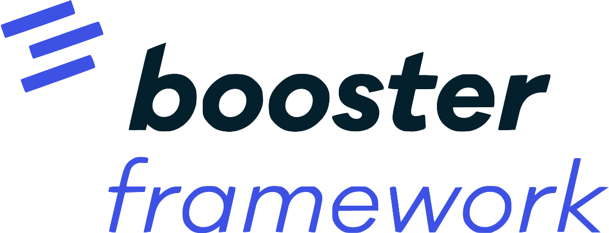

# 

---

## Disclaimer

Booster is a pre-release framework under heavy development, so non-backward-compatible changes might be introduced until we reach v1.0.0.

Refer to [Release Notes](https://github.com/boostercloud/booster/releases) for more specific information about changes of each iteration.

## The "Booster Way"

Booster is a highly opinionated true-serverless framework based on the following principles:

* *Play nicely*: Booster is not here to replace your toolkit, but to expand it. Booster's goal is to come along well together with your existing auth, queues, databases and services, providing a modern and swift tool to build new functionality that really squeezes the cloud.
* *DDD:* Software should be designed around business-level concepts to ease team's communication. All code in Booster is defined on terms of Commands, Events, Handlers and Entities, limiting the need of artificial developers-only constructs.
* *CQRS and Event-Sourcing:* Booster is designed around the concepts of CQRS and Event-Sourcing. This design has many advantages regarding scalability and data management. It even allows you to travel back in time!
* *The cloud is the machine:* We believe that infrastructure should be created transparently in the same way that a compiler hides the details of the target processor. We often think about Booster as the "TypeScript-to-Cloud compiler".
* *True Serverless*: Serverless is about stop caring about your servers, but many implementations still require long YAML files to describe your infrastructure, and you really need to know what you're doing. True Serverless means that you don't even care about cloud configuration, Booster will figure it out for you based on the code you write.
* *Convention over Configuration:* We prefer to provide  standardized highly-opinionated modules than highly-configurable ones. This helps us to keep your code small and follow the best security and structure practices when deploying your applications to the cloud. High consistency in your project and code structure also helps to abstract out most of the boilerplate.
* *Don't Repeat Yourself (Extreme edition):* /The only code that matters is the one that makes your application different/. We push TypeScript structure and type system to the limit to avoid the need of writing repetitive code, like object-to-JSON serializations, API or database schemas or redundant architecture layers. 
* *Self-documenting APIs* We adopted GraphQL because it's a self-documenting standard. You can grab a standard GraphQL client like [ApolloClient](https://github.com/apollographql/apollo-client) and start using a Booster backend in a minute.
* *Developer's productivity:* Software development is fun, and a modern tool should make it even more fun, reducing the effort needed for mundane tasks. Booster provides code generators to help you quickstart new projects and objects, and the framework types and APIs are hand-crafted to help your IDE help you.

## Documentation

Browse the [Booster Cloud Documentation](https://boostercloud.github.io/docs) to set up your environment and learn the core concepts of the Booster Cloud Framework.

## Examples

Find step-by-step guides and example apps in the [Examples](docs/examples) section.

## Ask the community

If you have any question that's not covered by the documentation and examples, go ahead and ask the community in [Discord](https://discord.gg/k7b4B8CDtT)
or go ahead and [create a new issue](https://github.com/boostercloud/booster/issues/new).

## Contributing

Please refer to [`CONTRIBUTING.md`](CONTRIBUTING.md). Pull requests are welcome. For major changes, please
open an issue first to discuss what you would like to change.

## License

The Booster Cloud Framework is licensed under the Apache License, Version 2.0. See the [LICENSE](LICENSE) file for more details.
