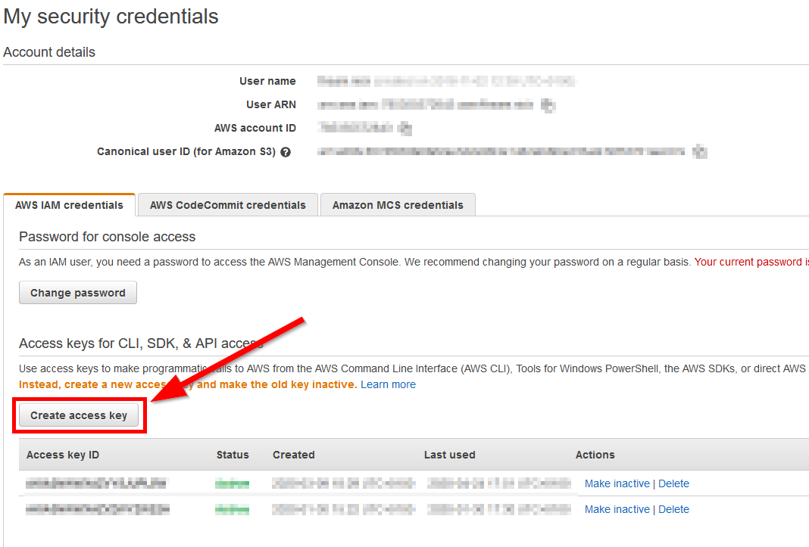
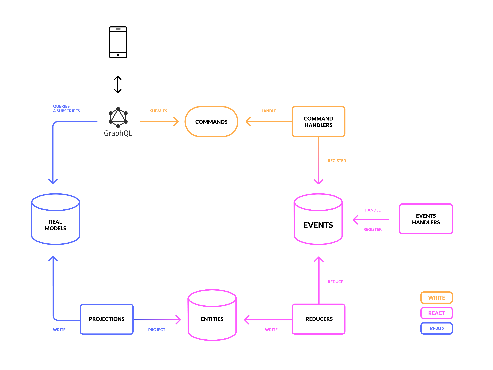
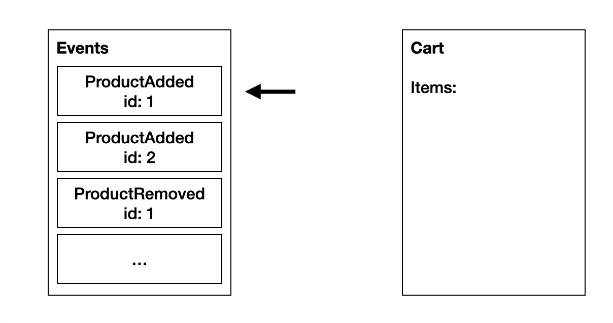
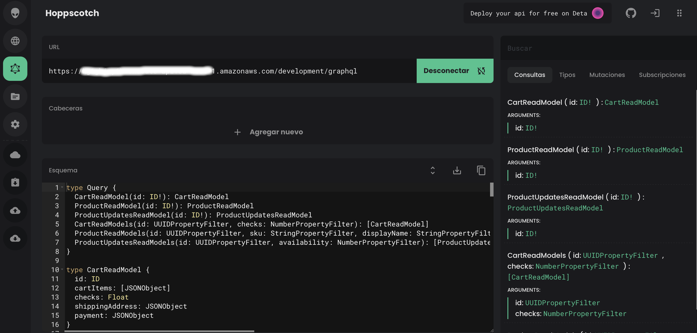

# Booster Documentation

<!-- toc -->

- [Introduction](#introduction)
  - [What is Booster?](#what-is-booster)
  - [Booster Principles](#booster-principles)
  - [Why use Booster](#why-use-booster)
- [Getting started](#getting-started)
  - [Installing Booster](#installing-booster)
    - [Prerequisites](#prerequisites)
    - [Installing the Booster CLI](#installing-the-booster-cli)
  - [Your first Booster app in 10 minutes](#your-first-booster-app-in-10-minutes)
    - [1. Create the project](#1-create-the-project)
    - [2. First command](#2-first-command)
    - [3. First event](#3-first-event)
    - [4. First entity](#4-first-entity)
    - [5. First read model](#5-first-read-model)
    - [6. Deployment](#6-deployment)
    - [7. Testing](#7-testing)
    - [8. Removing the stack](#8-removing-the-stack)
    - [9. More functionalities](#9-more-functionalities)
- [Booster architecture](#booster-architecture)
  - [1. Command and command handlers](#1-command-and-command-handlers)
    - [Commands naming convention](#commands-naming-convention)
    - [Creating a command](#creating-a-command)
    - [The command handler function](#the-command-handler-function)
    - [Authorizing a command](#authorizing-a-command)
    - [Submitting a command](#submitting-a-command)
    - [Scheduling a command](#scheduling-a-command)
    - [Creating a scheduled command](#creating-a-scheduled-command)
  - [2. Events](#2-events)
    - [Events naming convention](#events-naming-convention)
    - [Creating events](#creating-events)
    - [Registering events in the event store](#registering-events-in-the-event-store)
    - [Events ordering](#events-ordering)
  - [3. Event handlers](#3-event-handlers)
    - [Creating an event handler](#creating-an-event-handler)
    - [Registering events from an event handler](#registering-events-from-an-event-handler)
    - [Reading entities from event handlers](#reading-entities-from-event-handlers)
  - [4. Entities and reducers](#4-entities-and-reducers)
    - [Entities naming convention](#entities-naming-convention)
    - [Creating entities](#creating-entities)
    - [The reducer function](#the-reducer-function)
    - [Eventual consistency](#eventual-consistency)
  - [5. Read models and projections](#5-read-models-and-projections)
    - [Read models naming convention](#read-models-naming-convention)
    - [Creating a read model](#creating-a-read-model)
    - [The projection function](#the-projection-function)
    - [Authorizing read models](#authorizing-read-models)
    - [Querying a read model](#querying-a-read-model)
    - [Getting real-time updates for a read model](#getting-real-time-updates-for-a-read-model)
- [Features](#features)
  - [Authentication and Authorization](#authentication-and-authorization)
  - [Custom Authentication](#custom-authentication)
    - [JWT Configuration](#jwt-configuration)
  - [GraphQL API](#graphql-api)
    - [Relationship between GraphQL operations and commands and read models](#relationship-between-graphql-operations-and-commands-and-read-models)
    - [How to send GraphQL request](#how-to-send-graphql-request)
    - [Get GraphQL schema from deployed application](#get-graphql-schema-from-deployed-application)
    - [Sending commands](#sending-commands)
    - [Reading read models](#reading-read-models)
    - [Subscribing to read models](#subscribing-to-read-models)
    - [Using Apollo Client](#using-apollo-client)
    - [Authorizing operations](#authorizing-operations)
    - [The GraphQL over WebSocket protocol](#the-graphql-over-websocket-protocol)
  - [Cloud native](#cloud-native)
    - [Configure your provider credentials](#configure-your-provider-credentials)
    - [Deploy your project](#deploy-your-project)
    - [Application outputs](#application-outputs)
    - [Delete your cloud stack](#delete-your-cloud-stack)
- [Going deeper with Booster](#going-deeper-with-booster)
  - [Contributing](#contributing)
  - [Framework Core](#framework-core)
  - [Framework Types](#framework-types)
  - [Framework integration tests](#framework-integration-tests)
  - [Providers](#providers)
  - [Configuration and environments](#configuration-and-environments)
    - [Booster configuration](#booster-configuration)
    - [Environments](#environments)
  - [Extending Booster with Rockets!](#extending-booster-with-rockets)
    - [Create your own Rocket](#create-your-own-rocket)
    - [Naming recommendations](#naming-recommendations)
    - [Booster Rockets list](#booster-rockets-list)
- [Testing Booster applications](#testing-booster-applications)
- [Booster examples](#booster-examples)
- [Frequently Asked Questions](#frequently-asked-questions)

<!-- tocstop -->

## Introduction

> _Progress isn't made by early risers. It's made by lazy men trying to find easier ways to do something._ — [Robert A. Heinlein](https://en.wikipedia.org/wiki/Robert_A._Heinlein)

### What is Booster?

Booster is a new kind of framework to build scalable and reliable event-driven systems faster, reimagining the software development experience to maximize your team’s speed and reduce friction on every level.

Booster follows a Domain-Driven Design approach in which you define your application in terms that are understandable by anyone in your company. From a bird’s eye view, your project is organized into:

- **Commands**: Define what a user can request from the system (i.e: Add an item to the cart)
- **Events**: Simple records of facts (i.e: User X added item Y to the cart Z)
- **Entities**: Data about the things that the people in your company talk about (i.e: Orders, Customers, etc.)
- **Handlers**: Code that processes commands, reacts to events to trigger other actions, or update the entities after new events happen.

Events are the cornerstone of a Booster application, and that’s why we say that Booster is an event-driven framework. Events bring us many of the differentiating characteristics of Booster:

- **Real-time**: Events can trigger other actions when they’re created, and updates can be pushed to connected clients without extra requests.
- **High data resiliency**: Events are stored by default in an append-only database, so the data is never lost and it’s possible to recover any previous state of the system.
- **Scalable by nature**: Dependencies only happen at data level, so Booster apps can ingest more data without waiting for other operatons to complete. Low coupling also makes it easier to evolve the code without affecting other parts of the system.
- **Asynchronous**: Your users won't need to wait for your system to process the whole operation before continuing using it.

Before Booster, building an event-driven system with the mentioned characteristics required huge investments in hiring engineers with the needed expertise. Booster packs this expertise, acquired from real-case scenarios in high-scale companies, into a very simple tool that handles with the hard parts for you, even provisioning the infrastructure!

We have redesigned the whole developer experience from scratch, taking advantage of the advanced TypeScript type system and Serverless technologies to go from project generation to a production-ready application in the cloud which provides a real-time GraphQL API that can ingest thousands of concurrent users in a matter of minutes.

Booster's ultimate goal is making developer's lives easier, fulfilling the dream of writing code in a domain-driven way that eases communications for the whole team, without caring about how anything else is done at the infrastructure level!

### Booster Principles

Booster takes a holistic and highly-opinionated approach at many levels:

- **Focus on business value**: The only code that makes sense is the code that makes your application different from any other.
- **Convention over configuration**: All the supporting code and configuration that is similar in all applications should be out of programmers’ sight.
- **Serverless-less**: Why go Serverless to avoid managing infrastructure when you can implicitly infer your Serverless architecture from your code and not even deal with that?
- **Scale smoothly**: The code you write to handle your first 100 users will still work to handle your first million. You won't need to rewrite your application when it succeeds.
- **Event-source and CQRS**: Our world is event-driven, businesses are event-driven, and modern software maps better to reality when it’s event-driven.
- **Principle of Abstraction**: Building an application is hard enough to have to deal with recurring low-level details like SQL, API design, or authentication mechanisms, so we tend to build more semantic abstractions on top of them.
- **Real-time first**: Client applications must be able to react to events happening in the backend and notice data changes.

### Why use Booster

Booster will fit like a glove in applications that are naturally event-driven like commerce applications (retail, e-commerce, omnichannel applications, warehouse management, etc.), business applications or communication systems, but it's a general-purpose framework that has several advantages over other solutions:

- **Faster time-to-market**: Booster can deploy your application to a production-ready environment from minute one, without complicated configurations or needing to invest any effort to design it. In addition to that, it features a set of code generators to help developers build the project scaffolding faster and focus on actual business code in a matter of seconds instead of dealing with complicated framework folklore.
- **Write less code**: Booster conventions and abstractions require less code to implement the same features. This not only speeds up development but combined with clear architecture guidelines also makes Booster projects easier to understand, iterate, and maintain.
- **All the advantages of Microservices, none of its cons**: Microservices are a great way to deal with code complexity, at least on paper. Services are isolated and can scale independently, and different teams can work independently, but that usually comes with a con: interfaces between services introduce huge challenges like delays, hard to solve cyclic dependencies, or deployment errors. In Booster, every handler function works as an independent microservice, it scales separately in its own lambda function, and there are no direct dependencies between them, all communication happens asynchronously via events, and all the infrastructure is compiled, type-checked and deployed atomically to avoid issues.
- **All the advantages of Serverless, without needing a degree in cloud technologies**: Serverless technologies are amazing and have made a project like Booster possible, but they're relatively new technologies, and while day after day new tools appear to make them easier, the learning curve is still quite steep. With Booster you'll take advantage of Serverless’ main selling points of high scalability and reduced hosting costs, without having to learn every detail from minute one.
- **Event-sourcing by default**: Booster keeps all incremental data changes as events, indefinitely. This means that any previous state of the system can be recreated and replayed at any moment, enabling a whole world of possibilities for troubleshooting and auditing, syncing environments or performing tests and simulations.
- **Booster makes it easy to build enterprise-grade applications**: Implementing an event-sourcing system from scratch is a challenging exercise that usually requires highly specialized experts. There are some technical challenges like eventual consistency, message ordering, and snapshot building. Booster takes care of all of that and more for you, lowering the curve for people that are starting and making expert lives easier.
- **Choose your application cloud and avoid vendor locking:** Booster provides a highly decoupled architecture that enables the possibility of integrating with ease new providers with different specifications, including a custom Multi-cloud provider, without affecting the framework specification.

## Getting started

### Installing Booster

You can develop with Booster using any of the following operating systems:

- Linux
- macOS
- Windows (Native and WSL)

#### Prerequisites

##### Install Node.js

The minimal required Node.js version is `v12`. Download the installer
[from nodejs website](https://nodejs.org/en/), or install it using your system's package
manager.

###### Ubuntu

Just run the following commands on the terminal

```shell
curl -sL https://deb.nodesource.com/setup_14.x | sudo -E bash -
sudo apt install nodejs
```

###### macOS

Using [Homebrew](https://brew.sh) package manager, run the following command on the terminal

```shell
brew install node
```

###### Windows

Using [Chocolatey](https://chocolatey.org/) package manager, run the following command in your PowerShell

```shell
choco install nodejs
```

Verify that it was installed properly by checking so from your terminal:

```shell
$ node -v
v13.12.0

$ npm -v
6.14.4
```

As soon as you have a Node.js version higher than `v12`, and an `npm` version higher than
`6`, you are good to go. Just note that `npm` comes with node, you don't have to install
it apart.

Alternatively, we recommend you to use a version manager for dealing with different Node.js
versions:

- [`nvm`](https://github.com/nvm-sh/nvm) - Works with macOS, Linux, and Windows Subsystem
  for Linux
- [`nvm-windows`](https://github.com/coreybutler/nvm-windows) - Works with native Windows

##### Install Git

Booster will initialize a Git repository when you create a new project (unless you use the `--skipGit` flag), so it is required that you have it already installed in your system.

###### Ubuntu

```shell
sudo apt install git-all
```

###### macOS

```shell
brew install git
```

###### Windows

```shell
choco install git
```

###### Git configuration variables

After installing git in your machine, make sure that `user.name` and `user.email` are properly configured.
Take a look at the [Git configuration page](https://git-scm.com/docs/git-config) for more info.

To configure them, run in your terminal:

```shell
git config --global user.name "Your Name Here"
git config --global user.email "your_email@youremail.com"
```

##### Set up an AWS account

This step is optional; Booster is a cloud-native framework, meaning that your application
will be deployed to the cloud using different cloud providers. By default, Booster uses the
[AWS Provider](#aws-provider), so you need an AWS account. You can always omit
this step if you only want to get a grip of Booster or test it locally without making a
deployment.

> **Note**:
>
> Booster is free to use, but notice that the resources deployed to your cloud provider
> might generate some expenses.
>
> In AWS, all the resources generated by Booster are part of the [AWS free tier](https://aws.amazon.com/free).
> When you're not eligible for the free tier, resources are charged on-demand. Deploying a
> Booster project and sending a few commands and queries should cost just a few cents.
>
> In any case, make sure to un-deploy your application with the command `boost nuke -e production`
> if you're not planning to keep using it.

Now it is a good time to create that AWS account, you can do so from
[the AWS console registration](https://portal.aws.amazon.com/billing/signup).

Once you've registered yourself, you have to generate an access key for Booster. To do so,
login into the [AWS Console](https://console.aws.amazon.com), and click on your account
name on the top-right corner.


A menu will open, click on **My security credentials** and it will take you to the
Identity and Access Management panel. Once there, create an access key:



A pop-up like the following will appear, **don't close it!**. 


Using data from that pop-up, create a folder called `.aws` under your home
folder, and a file inside called `credentials` with this syntax:

```ini
# ~/.aws/credentials
[default]
aws_access_key_id = <YOUR ACCESS KEY ID>
aws_secret_access_key = <YOUR SECRET ACCESS KEY>
```

##### Multiple AWS Accounts

If you are using multiple AWS accounts and don't want to use the default profile,
you will need to set a `region` option to let the AWS SDK know which region you want your application to be deployed to.
To do so, we have two possible solutions:

- Add the region to the profile of your choice in your `~/.aws/credentials` file

```ini
# ~/.aws/credentials
[default]
aws_access_key_id = <DEFAULT ACCESS KEY ID>
aws_secret_access_key = <DEFAULT SECRET ACCESS KEY>
region=<DEFAULT REGION>

[other_profile] # Give this profile the name that works best for you
aws_access_key_id = <YOUR ACCESS KEY ID>
aws_secret_access_key = <YOUR SECRET ACCESS KEY>
region=<REGION FOR YOUR BOOSTER APP>
```

- Or creating a `~/.aws/config` file

```ini
# ~/.aws/config
[default]
region=<DEFAULT REGION>

[profile other_profile] # You can rename the profile in any way that works for you
region=<REGION FOR YOUR BOOSTER APP>
```

When using multiple profiles make sure to export the `AWS_PROFILE` environment variable to deploy or nuke
the application with the selected profile.

```shell
export AWS_PROFILE=other_profile
```

#### Installing the Booster CLI

Booster comes with a command-line tool that helps you generating boilerplate code,
testing and deploying the application, and deleting all the resources in the cloud. All
the stable versions are published to [`npm`](https://www.npmjs.com/package/@boostercloud/cli),
these versions are the recommended ones, as they are well documented, and the changes are
stated in the release notes.

To install the Booster CLI run this:

```shell
npm install --global @boostercloud/cli
```

Verify the Booster CLI installation with the `boost version` command. You should get back
something like

```shell
$ boost version
@boostercloud/cli/0.12.3 darwin-x64 node-v14.0.0
```

### Your first Booster app in 10 minutes

In this section, we will go through all the necessary steps to have the backend up and
running for a blog application in just a few minutes. The steps to follow will be:

- [Create project](#1-create-the-project)
- [First command](#2-first-command)
- [First event](#3-first-event)
- [First entity](#4-first-entity)
- [First read model](#5-first-read-model)
- [Deployment](#6-deployment)
- [Testing](#7-testing)
  - [Creating posts](#71-creating-posts)
  - [Retrieving all posts](#72-retrieving-all-posts)
  - [Retrieving specific post](#73-retrieving-specific-post)
- [Removing the stack](#8-removing-the-stack)
- [More functionalities](#9-more-functionalities)

#### 1. Create the project

First of all, we will use the Booster generators to create a project. Run this command and follow
the instructions, when asked for the provider, select AWS as that is what we have
configured [here](#set-up-an-aws-account).

```shell
> boost new:project boosted-blog

...

ℹ boost new 🚧
✔ Creating project root
✔ Generating config files
✔ Installing dependencies
ℹ Project generated!
```

**Note:** If you prefer to create the project with default parameters, you can run the command as `boost new:project booster-blog --default`. The default
parameters are as follows:

- Project name: The one provided when running the command, in this case "booster-blog"
- Provider: AWS
- Description, author, homepage and repository: ""
- License: MIT
- Version: 0.1.0

In case you want to specify each parameter without following the instructions, you can use the following flags with this structure `<flag>=<parameter>`.

| Flag                    | Short version | Description                                                                                     |
| :---------------------- | :------------ | :---------------------------------------------------------------------------------------------- |
| `--homepage`            | `-H`          | The website of this project                                                                     |
| `--author`              | `-a`          | Author of this project                                                                          |
| `--description`         | `-d`          | A short description                                                                             |
| `--license`             | `-l`          | License used in this project                                                                    |
| `--providerPackageName` | `-p`          | Package name implementing the cloud provider integration where the application will be deployed |
| `--repository`          | `-r`          | The URL of the repository                                                                       |
| `--version`             | `-v`          | The initial version                                                                             |

Additionally, you can use the `--skipInstall` flag if you want to skip installing dependencies and the `--skipGit` flag in case you want to skip git initialization.

> Booster CLI commands follow this structure: `boost <subcommand> [<flags>] [<parameters>]`.
> Let's break down the command we have just executed:
>
> - `boost` is the Booster CLI executable
> - `new:project` is the "subcommand" part. In this case, it is composed of two parts separated by a colon. The first part, `new`, means that we want to generate a new resource. The second part, `project`, indicates which kind of resource we are interested in. Other examples are `new:command`, `new:event`, etc. We'll see a bunch of them later.
> - `boosted-blog` is a "parameter" for the subcommand `new:project`. Flags and parameters are optional and their meaning and shape depend on the subcommand you used. In this case, we are specifying the name of the project we are creating.

**Note:** You can always use the `--help` flag to get all the available options for each cli command.

When finished, you'll see some scaffolding that has been generated. The project name will be the
project's root so `cd` into it:

```shell
cd boosted-blog
```

There you should have these files and directories already generated:

```text
boosted-blog
├── .eslintignore
├── .gitignore
├── .eslintrc.js
├── .prettierrc.yaml
├── package-lock.json
├── package.json
├── src
│   ├── commands
│   ├── common
│   ├── config
│   │   └── config.ts
│   ├── entities
│   ├── events
│   ├── event-handlers
│   ├── read-models
│   └── index.ts
├── tsconfig.eslint.json
└── tsconfig.json
```

Now open the project in your favorite editor, e.g. [Visual Studio Code](https://code.visualstudio.com/).

#### 2. First command

Commands define the input to our system, so we'll start by generating our first
[command](#1-command-and-command-handlers) to create posts. Use the command generator, while in the project's root
directory, as follows:

```bash
boost new:command CreatePost --fields postId:UUID title:string content:string author:string
```

The `new:command` generator creates a `create-post.ts` file in the `commands` folder:

```text
boosted-blog
└── src
    └── commands
        └── create-post.ts
```

As we mentioned before, commands are the input of our system. They're sent
by the users of our application. When they are received you can validate its data,
execute some business logic, and register one or more events. Therefore, we have to define two more things:

1. Who is authorized to run this command.
1. The events that it will trigger.

Booster allows you to define authorization strategies (we will cover that
later). Let's start by allowing anyone to send this command to our application.
To do that, open the file we have just generated and add the string `'all'` to the
`authorize` parameter of the `@Command` decorator. Your `CreatePost` command should look like this:

```typescript
@Command({
  authorize: 'all', // Specify authorized roles here. Use 'all' to authorize anyone
})
export class CreatePost {
  public constructor(
    readonly postId: UUID,
    readonly title: string,
    readonly content: string,
    readonly author: string
  ) {}

  public static async handle(command: CreatePost, register: Register): Promise<void> {
    register.events(/* YOUR EVENT HERE */)
  }
}
```

#### 3. First event

Instead of creating, updating, or deleting objects, Booster stores data in the form of events.
They are records of facts and represent the source of truth. Let's generate an event called `PostCreated`
that will contain the initial post info:

```bash
boost new:event PostCreated --fields postId:UUID title:string content:string author:string
```

The `new:event` generator creates a new file under the `src/events` directory.
The name of the file is the name of the event:

```text
boosted-blog
└── src
    └── events
        └── post-created.ts
```

All events in Booster must target an entity, so we need to implement an `entityID`
method. From there, we'll return the identifier of the post created, the field
`postID`. This identifier will be used later by Booster to build the final state
of the `Post` automatically. Edit the `entityID` method in `events/post-created.ts`
to return our `postID`:

```typescript
// src/events/post-created.ts

@Event
export class PostCreated {
  public constructor(
    readonly postId: UUID,
    readonly title: string,
    readonly content: string,
    readonly author: string
  ) {}

  public entityID(): UUID {
    return this.postId
  }
}
```

Now that we have an event, we can edit the `CreatePost` command to emit it. Let's change
the command's `handle` method to look like this:

```typescript
// src/commands/create-post.ts::handle
public static async handle(command: CreatePost, register: Register): Promise<void> {
  register.events(new PostCreated(command.postId, command.title, command.content, command.author))
}
```

Remember to import the event class correctly on the top of the file:

```typescript
import { PostCreated } from '../events/post-created'
```

We can do any validation in the command handler before storing the event, for our
example, we'll just save the received data in the `PostCreated` event.

#### 4. First entity

So far, our `PostCreated` event suggests we need a `Post` entity. Entities are a
representation of our system internal state. They are in charge of reducing (combining) all the events
with the same `entityID`. Let's generate our `Post` entity:

```bash
boost new:entity Post --fields title:string content:string author:string --reduces PostCreated
```

You should see now a new file called `post.ts` in the `src/entities` directory.

This time, besides using the `--fields` flag, we use the `--reduces` flag to specify the events the entity will reduce and, this way, produce the Post current state. The generator will create one _reducer function_ for each event we have specified (only one in this case).
Reducer functions in Booster work similarly to the `reduce` callbacks in Javascript: they receive an event
and the current state of the entity, and returns the next version of the same entity.
In this case, when we receive a `PostCreated` event, we can just return a new `Post` entity copying the fields
from the event. There is no previous state of the Post as we are creating it for the first time:

```typescript
// src/entities/post.ts
@Entity
export class Post {
  public constructor(public id: UUID, readonly title: string, readonly content: string, readonly author: string) {}

  @Reduces(PostCreated)
  public static reducePostCreated(event: PostCreated, currentPost?: Post): Post {
    return new Post(event.postId, event.title, event.content, event.author)
  }
}
```

Entities represent our domain model and can be queried from command or
event handlers to make business decisions or enforcing business rules.

#### 5. First read model

In a real application, we rarely want to make public our entire domain model (entities)
including all their fields. What is more, different users may have different views of the data depending
on their permissions. That's the goal of `ReadModels`. Client applications can query or
subscribe to them.

Read models are _projections_ of one or more entities into a new object that is reachable through the query and subscriptions APIs. Let's generate a `PostReadModel` that projects our
`Post` entity:

```bash
boost new:read-model PostReadModel --fields title:string author:string --projects Post:id
```

We have used a new flag, `--projects`, that allow us to specify the entities (can be many) the read model will
watch for changes. You might be wondering what is the `:id` after the entity name. That's the [joinKey](#the-projection-function),
but you can forget about it now.

As you might guess, the read-model generator will create a file called
`post-read-model.ts` under `src/read-models`:

```text
boosted-blog
└── src
    └── read-models
        └── post-read-model.ts
```

There are two things to do when creating a read model:

1. Define who is authorized to query or subscribe it
1. Add the logic of the projection functions, where you can filter, combine, etc., the entities fields.

While commands define the input to our system, read models define the output, and together they compound
the public API of a Booster application. Let's do the same we did in the command and authorize `all` to
query/subscribe the `PostReadModel`. Also, and for learning purposes, we will exclude the `content` field
from the `Post` entity, so it won't be returned when users request the read model.

Edit the `post-read-model.ts` file to look like this:

```typescript
// src/read-models/post-read-model.ts
@ReadModel({
  authorize: 'all', // Specify authorized roles here. Use 'all' to authorize anyone
})
export class PostReadModel {
  public constructor(public id: UUID, readonly title: string, readonly author: string) {}

  @Projects(Post, 'postId')
  public static projectPost(entity: Post, currentPostReadModel?: PostReadModel): ProjectionResult<PostReadModel> {
    return new PostReadModel(entity.id, entity.title, entity.author)
  }
}
```

#### 6. Deployment

At this point, we've:

- Created a publicly accessible command
- Emitted an event as a mechanism to store data
- Reduced the event into an entity to have a representation of our internal state
- Projected the entity into a read model that is also publicly accessible.

With this, you already know the basics to build event-driven, CQRS-based applications
with Booster.

You can check that code compiles correctly by running the build command:

```bash
boost build
```

You can also clean the compiled code by running:

```bash
boost clean
```

Now, let's deploy our application to the cloud to see it working. It is as simple as running
the deploy command:

```bash
boost deploy -e production
```

> Deploy command automatically builds the project for you before performing updates in the cloud provider, 
  so, build command it's not required beforehand.

> With `-e production` we are specifying which environment we want to deploy. We'll talk about them later.

And here it comes the Booster magic! ✨ When running the deploy command, Booster will handle the creation of all the resources, *like Lambdas, API Gateway,* and the "glue" between them; *permissions, events, triggers, etc.* It even creates a fully functional GraphQL API!

*If at this point you still don’t believe everything is done, feel free to check in your provider’s console. You should see, as in the AWS example below, that the stack and all the services are up and running!* 🚀


It will take a couple of minutes to deploy all the resources. Once finished, you will see
information about your application endpoints and other outputs. For this example, we will
only need to pick the output ending in `httpURL`, e.g.:

```text
https://<some random number>.execute-api.us-east-1.amazonaws.com/production
```

#### 7. Testing

Let's get started testing the project. We will perform three actions:

- Add a couple of posts
- Retrieve all posts
- Retrieve a specific post

Booster applications provide you with a GraphQL API out of the box. You send commands using
_mutations_ and get read models data using _queries_ or _subscriptions_.

In this section, we will be sending requests by hand using the online tool [Hoppscotch (formerly Postwoman)](https://hoppscotch.io/graphql),
which is free and includes great support for GraphQL. However, you can use any client you want. Your endpoint URL should look like this:

```text
<httpURL>/graphql
```

##### 7.1 Creating posts

Let's use two mutations to send two `CreatePost` commands.

```graphql
mutation {
  CreatePost(
    input: {
      postId: "95ddb544-4a60-439f-a0e4-c57e806f2f6e"
      title: "Build a blog in 10 minutes with Booster"
      content: "I am so excited to write my first post"
      author: "Boosted developer"
    }
  )
}
```

```graphql
mutation {
  CreatePost(
    input: {
      postId: "05670e55-fd31-490e-b585-3a0096db0412"
      title: "Booster framework rocks"
      content: "I am so excited for writing the second post"
      author: "Another boosted developer"
    }
  )
}
```

The expected response for each of those requests should be:

```json
{
  "data": {
    "CreatePost": true
  }
}
```

> **Note**: In this example, the IDs are generated on the client-side. When running production applications
> consider adding validation for ID uniqueness. For this example, we have used [a UUID generator](https://www.uuidgenerator.net/version4)

##### 7.2 Retrieving all posts

Let's perform a GraphQL `query` that will be hitting our `PostReadModel`:

```graphql
query {
  PostReadModels {
    id
    title
    author
  }
}
```

It should respond with something like:

```json
{
  "data": {
    "PostReadModels": [
      {
        "id": "05670e55-fd31-490e-b585-3a0096db0412",
        "title": "Booster framework rocks",
        "author": "Another boosted developer"
      },
      {
        "id": "95ddb544-4a60-439f-a0e4-c57e806f2f6e",
        "title": "Build a blog in 10 minutes with Booster",
        "author": "Boosted developer"
      }
    ]
  }
}
```

##### 7.3 Retrieving specific post

It is also possible to retrieve specific a `Post` by adding the `id` as input, e.g.:

```graphql
query {
  PostReadModel(id: "95ddb544-4a60-439f-a0e4-c57e806f2f6e") {
    id
    title
    author
  }
}
```

You should get a response similar to this:

```json
{
  "data": {
    "PostReadModel": {
      "id": "95ddb544-4a60-439f-a0e4-c57e806f2f6e",
      "title": "Build a blog in 10 minutes with Booster",
      "author": "Boosted developer"
    }
  }
}
```

#### 8. Removing the stack

It is convenient to destroy all the infrastructure created after you stop using
it to avoid generating cloud resource costs. Execute the following command from
the root of the project. For safety reasons, you have to confirm this action by
writing the project's name, in our case `boosted-blog` that is the same used when
we run `new:project` CLI command.

```bash
> boost nuke -e production

? Please, enter the app name to confirm deletion of all resources: boosted-blog
```

> Congratulations! You've built a serverless backend in less than 10 minutes. We hope you
> have enjoyed discovering the magic of the Booster Framework.

#### 9. More functionalities

This is a really basic example of a Booster application. The are many other features Booster provides like:

- Use a more complex authorization schema for commands and read models based on user roles
- Use GraphQL subscriptions to get updates in real-time
- Make events trigger other events
- Deploy static content
- Reading entities within command handlers to apply domain-driven decisions
- And much more...

Continue reading to dig more. You've just scratched the surface of all the Booster
capabilities!

## Booster architecture

Two patterns influence the Booster's event-driven architecture: Command-Query Responsibility Segregation ([CQRS](https://www.martinfowler.com/bliki/CQRS.html)) and [Event Sourcing](https://martinfowler.com/eaaDev/EventSourcing.html). They're complex techniques to implement from scratch with lower-level frameworks, but Booster makes them feel natural and very easy to use.



The public interface of a Booster application is just `Commands` and `ReadModels`. Booster proposes an entirely different approach to the Model-View-\* and CRUD frameworks. With Booster, clients submit commands, query the read models, or subscribe to them for receiving real-time updates thanks to the out of the box [GraphQL API](#graphql-api)

Booster applications are event-driven and event-sourced so, **the source of truth is the whole history of events**. When a client submits a command, the `CommandHandler` _wakes up_ and executes its logic. Optionally, it can _register_ as many `Events` as needed. The framework caches the current state by automatically _reducing_ all the registered events into `Entities`. Interested parties can _react_ to events via `EventHandlers`, and finally, the _projection_ functions transform the entities into `ReadModels`.

In this chapter you'll walk through these concepts and its details.

### 1. Command and command handlers

Booster is different than MVC frameworks in which you typically implement controller classes with CRUD methods. Instead of that, you define commands, which are the user actions when interacting with an application. This approach fits very well with Domain-Driven Design. Depending on your application's domain, some examples of commands would be: `RemoveItemFromCart`, `RatePhoto`, `AddCommentToPost`, etc. Although, you can still have `Create*`, `Delete*`, or `Update*` commands when they make sense.

There is an architectural split between commands and command handlers though they _live_ in the same file. The command is the class with the `@Command` decorator, and the generated method called `handle` is the command handler. That is because Booster adopts several concepts from functional programming; the separation between data structures and data transformations is one of them. In Booster, a command looks like this:

```typescript
@Command({
  authorize: 'all' | Array<RoleClass>
})
export class CommandName {
  public constructor(
    readonly fieldA: SomeType,
    readonly fieldB: SomeOtherType,
    /* as many fields as needed */
  ) {}

  public static async handle(command: CommandName, register: Register): Promise<void> {
    // Validate inputs
    // Run domain logic
    // register.events([event1,...])
  }
}
```

Every time you submit a command through the GraphQL API, Booster calls the command handler function for the given command. Commands are part of the public API, so you can define authorization policies for them. They are also the place for validating input data before registering events into the event store because they are immutable once there.

#### Commands naming convention

Semantics is very important in Booster as it will play an essential role in designing a coherent system. Your application should reflect your domain concepts, and commands are not an exception. Although you can name commands in any way you want, we strongly recommend you to name them starting with verbs in imperative plus the object being affected. If we were designing an e-commerce application, some commands would be:

- CreateProduct
- DeleteProduct
- UpdateProduct
- ChangeCartItems
- ConfirmPayment
- MoveStock
- UpdateCartShippingAddress

Despite you can place commands, and other Booster files, in any directory, we strongly recommend you to put them in `<project-root>/src/commands`. Having all the commands in one place will help you to understand your application's capabilities at a glance.

```text
<project-root>
├── src
│   ├── commands <------ put them here
│   ├── common
│   ├── config
│   ├── entities
│   ├── events
│   ├── index.ts
│   └── read-models
```

#### Creating a command

The preferred way to create a command is by using the generator, e.g.

```shell
boost new:command CreateProduct --fields sku:SKU displayName:string description:string price:Money
```

The generator will automatically create a file called `create-product.ts` with a TypeScript class of the same name under the `commands` directory. You can still create (or modify) the command manually. Since the generator is not doing any _magic_, all you need is a class decorated as `@Command`. Anyway, we recommend you always to use the generator, because it handles the boilerplate code for you.


> **Note**: Generating a command with the same name as an already existing one will prompt the user for confirmation.

#### The command handler function

Each command class must have a method called `handle`. This function is the command handler, and it will be called by the framework every time one instance of this command is submitted. Inside the handler you can run validations, return errors, query entities to make decisions, and register relevant domain events.

##### Validating data

Booster uses the typed nature of GraphQL to ensure that types are correct before reaching the handler, so you don't have to validate types.

###### Throw an error

There are still business rules to be checked before proceeding with a command. For example, a given number must be between a threshold or a string must match a regular expression. In that case, it is enough just to throw an error in the handler. Booster will use the error's message as the response to make it descriptive, e.g.

Given this command:

```typescript
@Command({
  authorize: 'all',
})
export class CreateProduct {
  public constructor(readonly sku: string, readonly price: number) {}

  public static async handle(command: CreateProduct, register: Register): Promise<void> {
    const priceLimit = 10
    if (command.price >= priceLimit) {
      throw new Error(`price must be below ${priceLimit}, and it was ${command.price}`)
    }
  }
}
```

And this mutation:

```graphql
mutation($input: CreateProductInput!) {
  CreateProduct(input: $input)
}

# Variables

{
  "input": {
    "sku": "MYSKU",
    "price": 19.99
  }
}
```

You'll get something like this response:

```grapqhl
{
  "errors": [
    {
      "message": "price must be below 10, and it was 19.99",
      "path": [
        "CreateProduct"
      ]
    }
  ]
}
```

###### Register error events

There could be situations in which you want to register an event representing an error. For example, when moving items with insufficient stock from one location to another:

```typescript
@Command({
  authorize: [Admin],
})
export class MoveStock {
  public constructor(
    readonly productID: string,
    readonly origin: string,
    readonly destination: string,
    readonly quantity: number
  ) {}

  public static async handle(command: MoveStock, register: Register): Promise<void> {
    if (!command.enoughStock(command.productID, command.origin, command.quantity)) {
      register.events(new ErrorEvent(`There is not enough stock for ${command.productID} at ${command.origin}`))
    } else {
      register.events(new StockMoved(/*...*/))
    }
  }

  private enoughStock(productID: string, origin: string, quantity: number): boolean {
    /* ... */
  }
}
```

In this case, the command operation can still be completed. An event handler will take care of that `ErrorEvent and proceed accordingly.

##### Reading entities

Event handlers are a good place to make decisions and, to make better decisions, you need information. There is a Booster function called `fetchEntitySnapshots` within the `Booster` package and allows you to inspect the application state. This function receives two arguments, the `Entity` to fetch and the `entityID`. Here is an example of fetching an entity called `Stock`:

```typescript
@Command({
  authorize: [Admin],
})
export class MoveStock {
  public constructor(
    readonly productID: string,
    readonly origin: string,
    readonly destination: string,
    readonly quantity: number
  ) {}

  public static async handle(command: MoveStock, register: Register): Promise<void> {
    const stock = await Booster.fetchEntitySnapshot(Stock, command.productID)
    if (!command.enoughStock(command.origin, command.quantity, stock)) {
      register.events(new ErrorEvent(`There is not enough stock for ${command.productID} at ${command.origin}`))
    }
  }

  private enoughStock(origin: string, quantity: number, stock?: Stock): boolean {
    const count = stock?.countByLocation[origin]
    return !!count && count >= quantity
  }
}
```

##### Registering events

Within the command handler execution, it is possible to register domain events. The command handler function receives the `register` argument, so within the handler, it is possible to call `register.events(...)` with a list of events. For more details about events and the register parameter, see the [`Events`](#2-events) section.

#### Authorizing a command

Commands are part of the public API of a Booster application, so you can define who is authorized to submit them. The Booster authorization feature is covered in [this](#authentication-and-authorization) section. So far, we have seen that you can make a command publicly accessible by authorizing `'all'` to submit it. You can also set specific roles as we did with the `authorize: [Admin]` parameter of the `MoveStock` command.

#### Submitting a command

Booster commands are accessible to the outside world as GraphQL mutations. GrahpQL fits very well with Booster's CQRS approach because it has two kinds of operations: Mutations and Queries. Mutations are actions that modify the server-side data, as the commands are.

Booster automatically creates one mutation per command. The framework infers the mutation input type from the command fields, e.g., given this `CreateProduct` command:

```typescript
@Command({
  authorize: 'all',
})
export class CreateProduct {
  public constructor(
    readonly sku: Sku,
    readonly displayName: string,
    readonly description: string,
    readonly price: number
  ) {}

  public static async handle(command: CreateProduct, register: Register): Promise<void> {
    register.events(/* YOUR EVENT HERE */)
  }
}
```

Booster generates this GraphQL mutation:

```text
mutation CreateProduct($input: CreateProductInput!): Boolean
```

where the schema for `CreateProductInput` is

```text
{
  sku: String
  displayName: String
  description: String
  price: Float
}
```

#### Scheduling a command

Scheduled commands are the way to add automated tasks to your application, like checking an e-commerce abandoned carts every two hours to send notifications to the customer to come back and complete the checkout. Booster scheduled commands are TypeScript classes decorated with `@ScheduledCommand`, and unlike conventional commands, their handle function doesn't have any parameters.

In Booster, a scheduled command looks like this:

```typescript
@ScheduledCommand({
  minute: '0/5', // runs every 5 minutes
})
export class CheckCartCount {
  public static async handle(): Promise<void> {
    /* YOUR CODE HERE */
  }
}
```

Notice that you can pass as parameters `minute`, `hour`, `day`, `month`, `weekDay` and `year` to set up a cron expression. By default, if no paramaters are passed, the scheduled command will not be triggered.

#### Creating a scheduled command

The preferred way to create a scheduled command is by using the generator, e.g.

```shell
boost new:scheduled-command CheckCartCount
```

### 2. Events

Events are **immutable records of facts** within your application's domain. They are the cornerstone of Booster because of its event-driven and event-sourced nature. Booster events are TypeScript classes decorated with `@Event`. An event class may look like this:

```typescript
@Event
export class EventName {
  public constructor(readonly field1: SomeType, readonly field2: SomeOtherType) {}

  public entityID(): UUID {
    return /* the associated entity ID */
  }
}
```

Events and [entities](#4-entities-and-reducers) are closely related. Each event belongs to one entity uniquely identified through the entityID method, and entities represent the application's state after reducing the stream of events. Indeed, an entity is just an aggregated representation of the same data present in its events, so it is possible to rebuild entities from events at any time. Booster guarantees that all the events associated with an entity will be reduced in the same order they were stored. Take a look at this event:

```typescript
@Event
export class CartPaid {
  public constructor(readonly cartID: UUID, readonly paymentID: UUID) {}

  public entityID(): UUID {
    // returns cartID because we want to associate it with
    // (and reduce it within) the Cart entity
    return this.cartID
  }
}
```

An event has to know the ID of the entity it belongs to and you need to implement the `entityID` method to return it. You can inject the entity ID directly in the event's constructor or as a nested attribute. If your domain requires a _singleton_ entity, where there's only one instance, you can return a constant value. In the `CartPaid` example, the entity ID (`cartID`) is injected directly.


> **Note**: The `entityID` method must always return the same value for the same event's instance. Otherwise, the result of the entity reduction will be unpredictable.

#### Events naming convention

As with commands, you can name events in any way you want, depending on your application's domain. However, we recommend you to choose short sentences written in past tense because events are facts that have happened and can't be changed. Some event names would be:

- ProductCreated
- ProductUpdated
- ProductDeleted
- CartItemChanged
- StockMoved

As with other Booster files, events have their own directory:

```text
<project-root>
├── src
│   ├── commands
│   ├── common
│   ├── config
│   ├── entities
│   ├── events <------ put them here
│   ├── index.ts
│   └── read-models
```

#### Creating events

The preferred way to create event files is the `new:event` generator, e.g.

```shell
boost new:event StockMoved --fields productID:string origin:string destination:string quantity:number
```

That will generate a file called `stock-moved.ts` under the proper `<project-root>/src/events` directory. You can also create the file manually, but we recommend using the generator and avoid dealing manually with boilerplate code.

> **Note**: Generating an event with the same name as an already existing one will prompt the user for confirmation.

#### Registering events in the event store

Creating an event file is different than storing an event instance in the event store. In Booster terminology, the latter receives the name of `registering` an event. As said before, Booster applications are event-sourced, which means that all the events are stored forever. Imagine this store as an infinite log used by the [reducer functions](#4-entities-and-reducers) to recreate the application's current state.

Booster injects the register as a parameter in the `handle` method of both the command and the event handlers. Then you can register events by calling the `register.events(...)` method as many times as you want, e.g.

##### Registering events from command handlers

```typescript
@Command({
  authorize: [Admin],
})
export class MoveStock {
  public constructor(
    readonly productID: string,
    readonly origin: string,
    readonly destination: string,
    readonly quantity: number
  ) {}

  public static async handle(command: MoveStock, register: Register): Promise<void> {
    if (!command.enoughStock(command.origin, command.quantity, command.productID)) {
      register.events(new ErrorEvent(`There is not enough stock for ${command.productID} at ${command.origin}`))
    }
  }
}
```

##### Registering events from event handlers

In the case of the event handlers, you also receive the event instance that triggered the handle function.

```typescript
@EventHandler(StockMoved)
export class HandleAvailability {
  public static async handle(event: StockMoved, register: Register): Promise<void> {
    if (event.origin == 'provider') {
      register.events(new ProductAvailabilityChanged(event.productID, event.quantity))
    } else if (event.destination == 'customer') {
      register.events(new ProductAvailabilityChanged(event.productID, -event.quantity))
    }
  }
}
```

### 3. Event handlers

As expected with event-driven architectures, multiple parts of our application react to events. In the case of Booster, we have entities (in charge of reducing the events) and event handlers. These last ones are classes decorated with the @EventHandler decorator. Every time a new instance of a given event is registered, the handle method of this class is triggered. This method can contain any business logic defined by the user or it can also register new events.

An event handler would look like this:

```typescript
@EventHandler(StockMoved)
export class HandleAvailability {
  public static async handle(event: StockMoved, register: Register): Promise<void> {
    if (event.origin == 'provider') {
      // New stock enters the system
      register.events(new ProductAvailabilityChanged(event.productID, event.quantity))
    } else if (event.destination == 'customer') {
      // Stock goes to the customer
      register.events(new ProductAvailabilityChanged(event.productID, -event.quantity))
    }
    // In terms of availability, it doesn't matter in which warehouse the stock is as soon as there's stock
  }
}
```

#### Creating an event handler

Event handlers can be easily created using the Booster CLI command `boost new:event-handler`. There are two mandatory arguments: the event handler name, and the name of the event it will react to. For instance:

```typescript
boost new:event-handler HandleAvailability --event StockMoved
```

Once the creation is completed, there will be a new file in the event handlers directory `<project-root>/src/event-handlers/handle-availability.ts`.

```text
<project-root>
├── src
│   ├── commands
│   ├── common
│   ├── config
│   ├── entities
│   ├── events
│   ├── event-handlers <------ put them here
│   └── read-models
```

#### Registering events from an event handler

Booster injects a `register` instance in the `handle` method that we can use to register extra events. In the above example, you can see there is some logic that ends up registering new events.

The `events(...)` method of the `register` allows triggering several events, you can specify as many as you need separated by commas as arguments of the function.

An example can be found below:

```typescript
register.events(new ProductAvailabilityChanged(event.productID, -event.quantity))
```

#### Reading entities from event handlers

Just as we do in command handlers, we can also retrieve entities information to make decisions based on their current state.

Let's say that we want to check the status of a product before we trigger its availability update. In that case we would call the `Booster.fetchEntitySnapshot` function, which will return information about the entity.

```typescript
public static async handle(event: StockMoved, register: Register): Promise<void> {
  const productSnapshot = await Booster.fetchEntitySnapshot(Product, event.productID)
  ...
}
```

### 4. Entities and reducers

The source of truth of your Booster app are the events, but events make sense in the context of a domain entity.
For example, in a banking app, there might be two events: `MoneyDeposited` and `MoneyWithdrawn`. However, these events
only make sense in the context of a `BankAccount`.

You can assume that entities are created on the fly by _reducing_ the whole event stream. Under the hood, Booster is creating
automatic snapshots for each entity so that the reduction process is efficient.

An entity is defined as a class with the `@Entity` decorator. Inside of it, you can write one or more static methods (called "reducers") with
the `@Reduces` decorator specifying the event they reduce. The reducer method will be called with two arguments: the event and the current state of the entity. Booster expects you to return a new entity with the changes implied by the event applied to the current one.

An entity class looks like this:

```typescript
@Entity
export class EntityName {
  public constructor(readonly fieldA: SomeType, readonly fieldB: SomeOtherType /* as many fields as needed */) {}

  @Reduces(SomeEvent)
  public static reduceSomeEvent(event: SomeEvent, currentEntityState?: EntityName): EntityName {
    /* Return a new entity based on the current one */
  }
}
```

There could be a lot of events being reduced concurrently among many entities, but, **for a specific entity instance, the events order is preserved**. This means that while one event is being reduced, all other events of any kind _that belong to the same entity instance_ will be waiting in a queue until the previous reducer has finished (with "entity instance" we refer to an entity of a specific type and with a specific ID). This is important to make sure that entities state is built correctly.

#### Entities naming convention

Entities are a representation of your application state in a specific moment, so name them as closely to your domain objects as possible. Typical entity names are nouns that might appear when you think about your app. In an e-commerce application, some entities would be:

- Cart
- Product
- UserProfile
- Order
- Address
- PaymentMethod
- Stock

Entities live within the entities directory of the project source: `<project-root>/src/entities`.

```text
<project-root>
├── src
│   ├── commands
│   ├── common
│   ├── config
│   ├── entities <------ put them here
│   ├── events
│   ├── index.ts
│   └── read-models
```

#### Creating entities

The preferred way to create an entity is by using the generator, e.g.

```text
boost new:entity Product --fields displayName:string description:string price:Money
```

The generator will automatically create a file called `product.ts` with a TypeScript class of the same name under the `entities` directory. You can still create the entity manually, writing a class decorated with `@Entity`. Anyway, we recommend you always to use the generator because it handles the boilerplate code for you.


> **Note**: Generating an entity with the same name as an already existing one will prompt the user for confirmation.

#### The reducer function

Booster generates the reducer function as a static method of the entity class. That function is called by the framework every time that an event of the specified type needs to be reduced. It's highly recommended to **keep your reducer functions pure**, which means that you should be able to produce the new entity version by just looking at the event and the current entity state. You should avoid calling third party services, reading or writing to a database, or changing any external state.

Booster injects two parameters to the reducer functions:

- `event` - The event object that triggered the reducer
- `currentEntity?` - The current state of the entity instance that the event belongs to if it exists. **This parameter is optional** and will be `undefined` if the entity don't exist yet (For example, when you process a `ProductCreated` event that will generate the first version of a `Product` entity).

This is how events change your application state.

Given this entity:

```ts
@Entity
export class Cart {
  public constructor(public id: UUID, readonly items: Array<CartItem>) {}

  @Reduces(ProductAdded)
  public static reduceProductAdded(event: ProductAdded, currentCart?: Cart): Cart {
    const newItems = addToCart(event.item, currentCart)
    return new Cart(event.cartID, newItems)
  }

  @Reduces(ProductRemoved)
  public static reduceProductRemoved(event: ProductRemoved, currentCart?: Cart): Cart {
    const newItems = removeFromCart(event.item, currentCart)
    return new Cart(event.cartID, newItems)
  }
}
```

You can visualize reduction like this:



#### Eventual consistency

Due to the event driven and async nature of Booster, your data might not be instantly updated. Booster will consume the commands, generate events, and _eventually_ generate the entities. Most of the time this is not perceivable, but under huge loads, it could be noticed.

This property is called [Eventual Consistency](https://en.wikipedia.org/wiki/Eventual_consistency), and it is a trade-off to have high availability for extreme situations, where other systems might simply fail.

### 5. Read models and projections

Read Models are cached data optimized for read operations. They're updated reactively when [Entities](#4-entities-and-reducers) are updated after reducing [events](#2-events). They also define the _Read API_.

Read Models are classes decorated with the `@ReadModel` decorator that have one or more projection methods.

```typescript
@ReadModel
export class ReadModelName {
  public constructor(readonly fieldA: SomeType, readonly fieldB: SomeType /* as many fields as needed */) {}

  @Projects(SomeEntity, 'entityField')
  public static projectionName(
    entity: SomeEntity,
    currentEntityReadModel?: ReadModelName
  ): ProjectionResult<ReadModelName> {
    return new ReadModelName(/* initialize here your constructor properties */)
  }

  @Projects(SomeEntity, 'othetEntityField')
  public static projectionName(
    entity: SomeEntity,
    currentEntityReadModel?: ReadModelName
  ): ProjectionResult<ReadModelName> {
    return new ReadModelName(/* initialize here your constructor properties */)
  }
  /* as many projections as needed */
}
```

#### Read models naming convention

As it has been previously commented, semantics plays an important role in designing a coherent system and your application should reflect your domain concepts, we recommend choosing a representative domain name and use the `ReadModel` suffix in your read models name.

Despite you can place your read models in any directory, we strongly recommend you to put them in `<project-root>/src/read-models`. Having all the read models in one place will help you to understand your application's capabilities at a glance.

```text
<project-root>
├── src
│   ├── commands
│   ├── common
│   ├── config
│   ├── entities
│   ├── read-models  <------ put them here
│   ├── events
│   ├── index.ts
│   └── read-models
```

#### Creating a read model

The preferred way to create a read model is by using the generator, e.g.

```shell
boost new:read-model CartReadModel --fields id:UUID cartItems:"Array<CartItem>" paid:boolean --projects Cart
```

The generator will create a Typescript class under the read-models directory `<project-root>/src/read-models/cart-read-model.ts`.

Read Model classes can also be created by hand and there are no restrictions. The structure of the data is totally open and can be as complex as you can manage in your projection functions.

#### The projection function

A `Projection` is a method decorated with the `@Projects` decorator that, given a new entity value and (optionally) the current read model state, generate a new read model value.

Read models can be projected from one or more [entities](#4-entities-and-reducers) as soon as all the entities involved have one field with the same semantics that can be used as a join key (usually an identifier or a reference to other entity). A join key in Booster is similar to join keys in relational databases, so you could see Read Models as reactive join operations that you can use to build data aggregates. When an entity is updated, Booster uses the join key to find the right read model instance, so all entities that share the same join key value will trigger the projections of the same read model. When defining a projection with the `@Projects` decorator, it's required to set the field name of the join key in each entity. Let's see an example:

```typescript
@ReadModel
export class UserReadModel {
  public constructor(readonly username: string, /* ...(other interesting fields from users)... */) {}

  @Projects(User, 'id')
  public static projectUser(entity: User, current?: ProjectionResult<UserReadModel>) { // Here we update the user fields}

  @Projects(Post, 'ownerId')
  public static projectUserPost(entity: Post, current?: ProjectionResult<UserReadModel>) { //Here we can adapt the read model to show specific user information related with the Post entity}
}
```

In the previous example we are projecting the `User` entity using the user `id` and also we are projecting the `User` entity based on the `ownerId` of the `Post` entity. Notice that both join keys are references to the `User` identifier, but it's not required that the join key is an identifier.

As you may have notice from the `ProjectionResult` type, projections can also return `ReadModelAction`, which includes:

1. Deletion of read models by returning the `ReadModelAction.Delete` value
2. You can also return `ReadModelAction.Nothing` to keep the read model untouched

```
@ReadModel
export class UserReadModel {
  public constructor(readonly username: string, /* ...(other interesting fields from users)... */) {}

  @Projects(User, 'id')
  public static projectUser(entity: User, current?: UserReadModel): ProjectionResult<UserReadModel>  {
    if (current?.deleted) {
      return ReadModelAction.Delete
    } else if (!current?.modified) {
      return ReadModelAction.Nothing
    }
    return new UserReadModel(...)
  }
```

#### Authorizing read models

Read models are the tool to build the public read API of a Booster application, so you can define who is authorized to query and subscribe to them. The Booster authorization feature is covered in [the auth section](#authentication-and-authorization). So far, we have seen that you can make a read model publicly accessible by authorizing `'all'` to query it or you can set specific roles providing an array of roles in this way: `authorize: [Admin]`.

#### Querying a read model

For every read model, Booster automatically creates all the necessary queries and subscriptions. For example, given this `CartReadModel`:

```typescript
@ReadModel({
  authorize: 'all',
})
export class CartReadModel {
  public constructor(public id: UUID, readonly items: Array<CartItem>) {}

  @Projects(Cart, 'id')
  public static projectCart(entity: Cart, currentReadModel: CartReadModel): ProjectionResult<CartReadModel> {
    return new CartReadModel(entity.id, entity.items)
  }
}
```

You will get the following GraphQL query and subscriptions:

```graphQL
query CartReadModel(id: ID!): CartReadModel
subscription CartReadModel(id: ID!): CartReadModel
subscription CartReadModels(id: UUIDPropertyFilter!): CartReadModel
```

For more information about queries and how to use them, please check the [GraphQL API](#reading-read-models) section.

#### Getting real-time updates for a read model

Booster GraphQL API also provides support for real-time updates using subscriptions and a web-socket. To get more information about it go to the [GraphQL API](#subscribing-to-read-models) section.

#### Getting and filtering read models data at code level

Booster allows you to get your read models data in your commands handlers and event handlers using the `Booster.readModel` method.

For example, you can filter and get the total number of the products that meet your criteria in your commands like this:

```typescript
@Command({
  authorize: 'all',
})
export class GetProductsCount {
  public constructor(readonly filters: Record<string, any>) {}

  public static async handle(): Promise<void> {
    const searcher = Booster.readModel(ProductReadModel)

    searcher.filter({
      sku: { contains: 'toy' },
      or: [
        {
          description: { contains: 'fancy' },
        },
        {
          description: { contains: 'great' },
        },
      ],
    })

    const result = await searcher.search()
    return { count: result.length }
  }
}
```

> **Warning**: Notice that `ReadModel`s are eventually consistent objects that are calculated as all events in all entities that affect the read model are settled. You should not assume that a read model is a proper source of truth, so you shouldn't use this feature for data validations. If you need to query the most up-to-date current state, consider fetching your Entities, instead of ReadModels, with `Booster.fetchEntitySnapshot`

## Features

### Authentication and Authorization

You can use the [Authentication Rocket](https://github.com/boostercloud/rocket-auth-aws-infrastructure) for adding the authentication and authorization to you application. But first, you need to know that authorization in Booster is done through roles. Every Command and ReadModel has an `authorize` policy that tells Booster who can execute or access it. It consists of one of the following two values:

- `'all'`: Meaning that the command is public: any user, both authenticated and anonymous, can execute it.
- An array of authorized roles `[Role1, Role2, ...]`: This means that only those authenticated users that
  have any of the roles listed there are authorized to execute the command

For example, the following command can be executed by anyone:

```typescript
@Command({
  authorize: 'all',
})
export class CreateComment {
  ...
}
```

While this one can be executed by authenticated users that have the role `Admin` or `User`:

```typescript
@Command({
  authorize: [Admin, User],
})
export class UpdateUser {
  ...
}
```

By default, a Booster application has no roles defined, so the only allowed value you can use in the `authorize` policy is `'all'` (good for public APIs).
If you want to add user authorization, you first need to create the roles that are suitable for your application.
Roles are classes annotated with the `@Role` decorator, where you can specify some attributes. We recommend that you define your roles in the file `src/roles.ts` or, if you have too many roles, put them in several files under the `src/roles` folder.

_Note: There is no `Admin` user by default. In order to register one you need to specify a sign-up method on `src/roles.ts`._

In the following example we define `Admin`, `User`, `SuperUser` and `SuperUserWithoutConfirmation` roles. They all contain an `auth` attribute which contains a `signUpMethods` and `skipConfirmation` attributes.

```typescript
// src/roles.ts

@Role({
  auth: {
    // Do not specify (or use an empty array) if you don't want to allow sign-ups
    signUpMethods: [],
  },
})
export class Admin {}

@Role({
  auth: {
    // Do not specify (or use an empty array) if you don't want to allow sign-ups
    signUpMethods: ['email'],
  },
})
export class User {}

@Role({
  auth: {
    signUpMethods: ['email', 'phone'],
    skipConfirmation: false,
  },
})
export class SuperUser {}

@Role({
  auth: {
    signUpMethods: ['email', 'phone'],
    skipConfirmation: true,
  },
})
export class SuperUserWithoutConfirmation {}
```

When `signUpMethods` is empty (`Admin` role) or is not specified, a user can't use this role to sign up.
`signUpMethods` is an array with limited possible values: `email`, `phone` or a combination of both.
Users with the `User` role will only be able to sign up with their emails, whereas the ones with the `SuperUser` role will be able to sign up with either their email or their phone number.

When `skipConfirmation` is false or not specified, a confirmation is required for the chosen sign up method.
Users that sign up with their emails will receive a confirmation link in their inbox. They just need to click it to confirm their registration.
Users that sign up with their phones will receive a confirmation code as an SMS message. That code needs to be sent back using the [confirmation endpoint](#sign-up/confirm)
If `skipConfirmation` is set to true, users can sign in without confirmation after signing up.

Now with the roles defined, your Booster application is ready to use the Authorization Rocket, please check out its [documentation](https://github.com/boostercloud/rocket-auth-aws-infrastructure) for getting the access tokens.

Once a user has an access token, it can be included in any request made to your Booster application as a
_Bearer_ token. It will be used to get the user information and
authorize them to access protected resources.

To learn how to include the access token in your requests, check the section [Authorizing operations](#authorizing-operations).

### Custom Authentication

You can use the **JWT authorization mode** to authorize all incoming Booster requests. Your auth server will return JWT tokens
wich will be decoded internally by Booster, after that, the required roles will be matched with the contained claims
inside that token.

In that way, you can use different auth providers, like Auth0, Firebase, Cognito, create your own or simply use our [Authentication Rocket](https://github.com/boostercloud/rocket-auth-aws-infrastructure), which is our recommended solution that works great with Booster.

#### JWT Configuration

In order to use the JWT authorization you will need to set a `tokenVerifier` property which contains the following properties:

- jwksUri: Public uri with the public keys the auth server used to sign in the JWT tokens, commonly known as a key sets.
- issuer: Identifies the principal that issued the JWT tokens.

Auth sample configuration:

```typescript
import { Booster } from '@boostercloud/framework-core'
import { BoosterConfig } from '@boostercloud/framework-types'
import * as AWS from '@boostercloud/framework-provider-aws'

Booster.configure('production', (config: BoosterConfig): void => {
  config.appName = 'demoapp'
  config.provider = AWS.Provider
  config.tokenVerifier = {
    jwksUri: 'https://demoapp.auth0.com/.well-known/jwks.json',
    issuer: 'auth0',
  }
})
```

In addition to that, you will need to configure your JWT tokens to include the custom claims required in your Booster app, i.e. if your command is declared in this way:

```typescript
@Command({
  authorize: [Admin, User],
})
export class UpdateUser {
  ...
}
```

Your token should include a property `custom:role` with the value `Admin` or `User`. Here is an example of a Firebase token:

```json
{
  "custom:role": "User",
  iss: "https://securetoken.google.com/demoapp",
  aud: "demoapp",
  auth_time: 1604676721,
  user_id: "xJY5Y6fTbVggNtDjaNh7cNSBd7q1",
  sub: "xJY5Y6fTbVggNtDjaNh7cNSBd7q1",
  iat: 1604676721,
  exp: 1604680321,
  phone_number: "+999999999",
  firebase: { ... }
}
```

Once you have the token with the auth provider of choice, simply pass it in the requests through the header:

```http request
Authorization: Bearer <your JWT token>
```

### GraphQL API

This is the main API of your application, as it allows you to:

- _Modify_ data by **sending commands**.
- _Read_ data by **querying read models**.
- _Receive data in real time_ by **subscribing to read models**.

All this is done through [GraphQL](https://graphql.org/), a query language for APIs that has useful advantages over simple REST APIs.

If you are not familiar with GraphQL, then, first of all, don't worry!
_Using_ a GraphQL API is simple and straightforward.
_Implementing it_ on the server side is usually the hard part, as you need to define your schema, operations, resolvers, etc.
Luckily, you can forget about that because Booster does all the work for you!

The GraphQL API is fully **auto-generated** based on your _commands_ and _read models_.

#### Relationship between GraphQL operations and commands and read models

GraphQL defines three kinds of operations that you can use: _mutations_, _queries_, and _subscriptions_.

The names are pretty meaningful, but we can say that you use a `mutation` when you want to change data, a `query` when you want to get
data on-demand, and a `subscription` when you want to receive data at the moment it is updated.

Knowing this, you can infer the relationship between those operations and your Booster components:

- You _send_ a **command** using a **mutation**.
- You _read_ a **read model** using a **query**.
- You _subscribe_ to a **read model** using a **subscription**.

#### How to send GraphQL request

GraphQL uses two existing protocols:

- _HTTP_ for `mutation` and `query` operations.
- _WebSocket_ for `subscription` operations.

The reason for the WebSocket protocol is that, in order for subscriptions to work, there must be a way for the server to send data to clients when it is changed. HTTP doesn't allow that, as it is the client the one which always initiates the request.

So you should use the **graphqlURL** to send GraphQL queries and mutations, and the **websocketURL** to send subscriptions. You can see both URLs after deploying your application.

Therefore:

- To send a GraphQL mutation/query, you send an HTTP request to _"&lt;graphqlURL&gt;"_, with _method POST_, and a _JSON-encoded body_ with the mutation/query details.
- To send a GraphQL subscription, you first connect to the _"&lt;websocketURL&gt;"_, and then send a _JSON-encoded message_ with the subscription details, _following [the "GraphQL over WebSocket" protocol](#the-graphql-over-websocket-protocol)_.

> **Note**: you can also **send queries and mutations through the WebSocket** if that's convenient to you. See ["The GraphQL over WebSocket protocol"](#the-graphql-over-websocket-protocol) to know more.

While it is OK to know how to manually send GraphQL request, you normally don't need to deal with this low-level details, especially with the WebSocket stuff.

To have a great developer experience, we **strongly recommend** to use a GraphQL client for your platform of choice. Here are some great ones:

- **[Hoppscotch (formerly Postwoman)](https://hoppscotch.io/)**: Ideal for testing sending manual requests, getting the schema, etc.
- **Apollo clients**: These are the "go-to" SDKs to interact with a GraphQL API from your clients. It is very likely that there is a version for your client programming language. Check the ["Using Apollo Client"](#using-apollo-client) section to know more about this.

#### Get GraphQL schema from deployed application

After deploying your application with the command `boost deploy -e development`, you can get your GraphQL schema by using a tool like **[Hoppscotch (formerly Postwoman)](https://hoppscotch.io/)**. The previous command displays multiple endpoints, one of them is **graphqlURL**, which has the following pattern:

`https://<base_url>/<environment>/graphql`

By entering this URL in Hoppscotch, the schema can be displayed as shown in the screenshot (You need to select GraphQL mode in the left bar of the tool, fill in the URL and press the button):



#### Sending commands

As mentioned in the previous section, we need to use a "mutation" to send a command. The structure of a mutation (the body of the request) is the following:

```graphql
mutation {
  command_name(input: {
    input_field_list
  })
}
```

Where:

- _**command_name**_ is the name of the class corresponding to the command you want to send
- _**input_field_list**_ is a list of pairs in the form of `fieldName: fieldValue` containing the data of your command. The field names correspond to the names of the properties you defined in the command class.

In the following example we send a command named "ChangeCart" that will add/remove an item to/from a shopping cart. The command requires the ID of the cart (`cartId`), the item identifier (`sku`) and the quantity of units we are adding/removing (`quantity`).

```
URL: "<graphqlURL>"
```

```graphql
mutation {
  ChangeCart(input: { cartId: "demo", sku: "ABC_01", quantity: 2 })
}
```

In case we are not using any GraphQL client, this would be the equivalent bare HTTP request:

```
URL: "<graphqlURL>"
METHOD: "POST"
```

```json
{
  "query": "mutation { ChangeCart(input: { cartId: \"demo\" sku: \"ABC_01\" quantity: 2 }) }"
}
```

And this would be the response:

```json
{
  "data": {
    "ChangeCart": true
  }
}
```

> **Note**: Remember to set the proper **access token** for secured commands, check ["Authorizing operations"](#authorizing-operations).

#### Reading read models

To read a specific read model, we need to use a "query" operation. The structure of the "query" (the body
of the request) is the following:

```graphql
query {
  read_model_name(id: "<id of the read model>") {
    selection_field_list
  }
}
```

Where:

- _read_model_name_ is the name of the class corresponding to the read model you want to retrieve.
- _&lt;id of the read model&gt;_ is the ID of the specific read model instance you are interested in.
- _selection_field_list_ is a list with the names of the specific read model fields you want to get as response.

In the following example we send a query to read a read model named `CartReadModel` whose ID is `demo`. We get back its `id` and the list of cart `items` as response.

```
URL: "<graphqlURL>"
```

```graphql
query {
  CartReadModel(id: "demo") {
    id
    items
  }
}
```

In case we are not using any GraphQL client, this would be the equivalent bare HTTP request:

```
URL: "<graphqlURL>"
METHOD: "POST"
```

```json
{
  "query": "query { CartReadModel(id: \"demo\") { id items } }"
}
```

And we would get the following as response:

```json
{
  "data": {
    "CartReadModel": {
      "id": "demo",
      "items": [
        {
          "sku": "ABC_01",
          "quantity": 2
        }
      ]
    }
  }
}
```

> **Note**: Remember to set the proper **access token** for secured read models, check ["Authorizing operations"](#authorizing-operations).

#### Subscribing to read models

To subscribe to a specific read model, we need to use a subscription operation, and it must be _sent through the **websocketURL**_ using the [_GraphQL over WebSocket_ protocol](#the-graphql-over-websocket-protocol).

Doing this process manually is a bit cumbersome. _You will probably never need to do this_, as GraphQL clients like [Apollo](#using-apollo-client) abstract this process away. However, we will explain how to do it for learning purposes.

Before sending any subscription, you need to _connect_ to the WebSocket to open the two-way communication channel. This connection is done differently depending on the client/library you use to manage web sockets. In this section, we will show examples using the [`wscat`](https://github.com/websockets/wscat) command line program. You can also use the online tool [Hoppscotch (formerly Postwoman)](https://hoppscotch.io/)

Once you have connected successfully, you can use this channel to:

- Send the subscription messages.
- Listen for messages sent by the server with data corresponding to your active subscriptions.

The structure of the "subscription" (the body of the message) is exactly the same as the "query" operation:

```graphql
subscription {
  read_model_name(id: "<id of the read model>") {
    selection_field_list
  }
}
```

Where:

- _read_model_name_ is the name of the class corresponding to the read model you want to subscribe to.
- _&lt;id of the read model&gt;_ is the ID of the specific read model instance you are interested in.
- _selection_field_list_ is a list with the names of the specific read model fields you want to get when data is sent back to you.

In the following examples we use [`wscat`](https://github.com/websockets/wscat) to connect to the web socket. After that, we send the required messages to conform the [_GraphQL over WebSocket_ protocol](#the-graphql-over-websocket-protocol), including the subscription operation to the read model `CartReadModel` with ID `demo`.

1. Connect to the web socket:

```sh
 wscat -c <websocketURL> -s graphql-ws
```

> **Note:** You should specify the `graphql-ws` subprotocol when connecting with your client via the `Sec-WebSocket-Protocol` header (in this case, `wscat` does that when you use the `-s` option).

Now we can start sending messages just by writing them and hitting the <kbd>Enter</kbd> key.

2. Initiate the protocol connection :

```json
{ "type": "connection_init" }
```

In case you want to authorize the connection, you need to send the authorization token in the `payload.Authorization` field:

```json
{ "type": "connection_init", "payload": { "Authorization": "<your token>" } }
```

3. Send a message with the subscription. We need to provide an ID for the operation. When the server sends us data back, it will include this same ID so that we know which subscription the received data belongs to (again, this is just for learning, [GraphQL clients](#using-apollo-client) manages this for you)

```json
{ "id": "1", "type": "start", "payload": { "query": "subscription { CartReadModel(id:\"demo\") { id items } }" } }
```

After a successful subscription, you won't receive anything in return. Now, every time the read model you subscribed to is modified, a new incoming message will appear in the socket with the updated version of the read model. This message will have exactly the same format as if you were done a query with the same parameters.

Following with the previous example, we now send a command (using a mutation operation) that adds a new item with sku "ABC_02" to the `CartReadModel`. After it has been added, we receive the updated version of the read model through the socket.

1. Send the following command (this time using an HTTP request):

```
URL: "<graphqlURL>"
```

```graphql
mutation {
  ChangeCart(input: { cartId: "demo", sku: "ABC_02", quantity: 3 })
}
```

2. The following message (after formatting it) appears through the socket connection we had opened:

```json
{
  "id": "1",
  "type": "data",
  "payload": {
    "data": {
      "CartReadModel": {
        "id": "demo",
        "items": [
          {
            "sku": "ABC_01",
            "quantity": 2
          },
          {
            "sku": "ABC_02",
            "quantity": 3
          }
        ]
      }
    }
  }
}
```

> **Note**: Remember that, in case you want to subscribe to a read model that is restricted to a specific set of roles, you must send the **access token** retrieved upon sign-in. Check ["Authorizing operations"](#authorizing-operations) to know how to do this.

#### Using Apollo Client

One of the best clients to connect to a GraphQL API is the [Apollo](https://www.apollographql.com/) client. There will probably be a version for your client technology of choice. These are the main ones:

- [For Javascript/Typescript](https://www.apollographql.com/docs/react/) ([Github](https://github.com/apollographql/apollo-client))
- [For iOS](https://www.apollographql.com/docs/ios/) ([Github)](https://github.com/apollographql/apollo-ios))
- [For Java/Kotlin/Android](https://www.apollographql.com/docs/android/) ([Github](https://github.com/apollographql/apollo-android))

We recommend referring to the documentation of those clients to know how to use them. Here is an example of how to fully instantiate the Javascript client so that it works for queries, mutations and subscriptions:

```typescript
import { split, HttpLink } from '@apollo/client'
import { getMainDefinition } from '@apollo/client/utilities'
import { WebSocketLink } from '@apollo/client/link/ws'
import { ApolloClient, InMemoryCache } from '@apollo/client'
import { SubscriptionClient } from 'subscriptions-transport-ws'

// Helper function that checks if a GraphQL operation is a subscription or not
function isSubscriptionOperation({ query }) {
  const definition = getMainDefinition(query)
  return definition.kind === 'OperationDefinition' && definition.operation === 'subscription'
}

// Create an HTTP link for sending queries and mutations
const httpLink = new HttpLink({
  uri: '<httpURL>',
})

// Create a SusbscriptionClient and a WebSocket link for sending subscriptions
const subscriptionClient = new SubscriptionClient('<websocketURL>', {
  reconnect: true,
})
const wsLink = new WebSocketLink(subscriptionClient)

// Combine both links so that depending on the operation, it uses one or another
const splitLink = split(isSubscriptionOperation, wsLink, httpLink)

// Finally, create the client using the link created above
const client = new ApolloClient({
  link: splitLink,
  cache: new InMemoryCache(),
})
```

Now, we can send queries, mutations and subscriptions using the `client` instance:

```typescript
import gql from 'graphql-tag'

// Query the CartReadModel
const readModelData = await client.query({
  variables: {
    cartID: 'demo',
  },
  query: gql`
    query QueryCart($cartID: ID!) {
      CartReadModel(id: $cartID) {
        id
        items
      }
    }
  `,
})

// Send a command (mutation)
const commandResult = await client.mutate({
  variables: {
    cartID: 'demo',
    sku: 'ABC_02',
  },
  mutation: gql`
    mutation AddOneItemToCart($cartID: ID!, $sku: string!) {
      ChangeCart(input: { cartId: $cartID, sku: $sku, quantity: 1 })
    }
  `,
})

// Subscribe to changes in the CartReadModel
const subscriptionOperation = client.subscribe({
  variables: {
    cartID: 'demo',
  },
  query: gql`
    subscription SubscribeToCart($cartID: ID!) {
      CartReadModel(id: $cartID) {
        id
        cartItems
      }
    }
  `,
})

subscriptionOperation.subscribe({
  next: (cartReadModel) => {
    // This function is called everytime the CartReadModel with ID="demo" is changed
    // Parameter "cartReadModel" contains the latest version of the cart
  },
})
```

#### Authorizing operations

When you have a command or read model whose access is authorized to users with a specific set of roles (see [Authentication and Authorization](#authentication-and-authorization)), you need to use an authorization token to send queries, mutations or subscriptions to that command or read model. 

You can use Authentication Rocket to authorize operations, see its [documentation](https://github.com/boostercloud/rocket-auth-aws-infrastructure) and, more especifically, the [Sign in](https://github.com/boostercloud/rocket-auth-aws-infrastructure#sign-in) section to know how to get a token. Once you have a token, the way to send it varies depending on the protocol you are using to send GraphQL operations:

- For **HTTP**, you need to send the HTTP header `Authorization` with the token, making sure you prefix it with `Bearer` (the kind of token Booster uses). For example:

```http request
Authorization: Bearer <your token>
```

- For **WebSocket**, you need to adhere to the [GraphQL over WebSocket protocol](#the-graphql-over-websocket-protocol) to send authorization data. The way to do that is by sending the token in the payload of the first message you send when initializing the connection (see [Subscribing to read models](#subscribing-to-read-models)). For example:

```json
{ "type": "connection_init", "payload": { "Authorization": "<your token>" } }
```

You normally won't be sending tokens in such a low-level way. GraphQL clients have easier ways to send these tokens. See [Sending tokens with Apollo client](#sending-tokens-with-apollo-clients)

##### Sending tokens with Apollo clients

We recommend going to the specific documentation of the specific Apollo client you are using to know how to send tokens. However, the basics of this guide remains the same. Here is an example of how you would configure the Javascript/Typescript Apollo client to send the authorization token. The example is exactly the same as the one shown in the [Using Apollo clients](#using-apollo-client) section, but with the changes needed to send the token. Notice that `<AuthApiEndpoint>` and `<idToken>` are obtained from the [Authentication Rocket](https://github.com/boostercloud/rocket-auth-aws-infrastructure).

```typescript
import { split, HttpLink, ApolloLink } from '@apollo/client'
import { getMainDefinition } from '@apollo/client/utilities'
import { WebSocketLink } from '@apollo/client/link/ws'
import { ApolloClient, InMemoryCache } from '@apollo/client'
import { SubscriptionClient } from 'subscriptions-transport-ws'

function isSubscriptionOperation({ query }) {
  const definition = getMainDefinition(query)
  return definition.kind === 'OperationDefinition' && definition.operation === 'subscription'
}

// CHANGED: We now use the AuthApiEndpoint obtained by the auth rocket
const httpLink = new HttpLink({
  uri: '<AuthApiEndpoint>',
})

// CHANGED: We create an "authLink" that modifies the operation by adding the token to the headers
const authLink = new ApolloLink((operation, forward) => {
  operation.setContext({
    headers: {
      Authorization: 'Bearer <idToken>',
    },
  })
  return forward(operation)
})

// <-- CHANGED: Concatenate the links so that the "httpLink" receives the operation with the headers set by the "authLink"
const httpLinkWithAuth = authLink.concat(httpLink)

const subscriptionClient = new SubscriptionClient('<websocketURL>', {
  reconnect: true,
  // CHANGED: added a "connectionParam" property with a function that returns the `Authorizaiton` header containing our token
  connectionParams: () => {
    return {
      Authorization: 'Bearer <idToken>',
    }
  },
})
const wsLink = new WebSocketLink(subscriptionClient)

const splitLink = split(isSubscriptionOperation, wsLink, httpLinkWithAuth) // Note that we now are using "httpLinkWithAuth"

const client = new ApolloClient({
  link: splitLink,
  cache: new InMemoryCache(),
})
```

##### Refreshing tokens with Apollo clients

Authorization tokens expire after a certain amount of time. When a token is expired, you will get an error and you will need to call the [refresh the token](https://github.com/boostercloud/rocket-auth-aws-infrastructure#refresh-token) endpoint to get a new token. After you have done so, you need to use the new token in your GraphQL operations.

There are several ways to do this. Here we show the simplest one for learning purposes.

First, we modify the example shown in the section [Sending tokens with apollo clients](#sending-tokens-with-apollo-clients) so that the token is stored in a global variable and the Apollo links get the token from it. That variable will be updated when the user signs-in and the token is refreshed:

```typescript
import { split, HttpLink, ApolloLink } from '@apollo/client'
import { getMainDefinition } from '@apollo/client/utilities'
import { WebSocketLink } from '@apollo/client/link/ws'
import { ApolloClient, InMemoryCache } from '@apollo/client'
import { SubscriptionClient } from 'subscriptions-transport-ws'

let authToken = undefined // <-- CHANGED: This variable will hold the token and will be updated everytime the token is refreshed

function isSubscriptionOperation({ query }) {
  const definition = getMainDefinition(query)
  return definition.kind === 'OperationDefinition' && definition.operation === 'subscription'
}

const httpLink = new HttpLink({
  uri: '<AuthApiEndpoint>',
})

const authLink = new ApolloLink((operation, forward) => {
  if (authToken) {
    operation.setContext({
      headers: {
        Authorization: `Bearer ${authToken}`, // <-- CHANGED: We use the "authToken" global variable
      },
    })
  }
  return forward(operation)
})

const httpLinkWithAuth = authLink.concat(httpLink)

const subscriptionClient = new SubscriptionClient('<websocketURL>', {
  reconnect: true,
  // CHANGED: added a "connectionParam" property with a function that returns the `Authorizaiton` header containing our token
  connectionParams: () => {
    if (authToken) {
      return {
        Authorization: `Bearer ${authToken}`, // <-- CHANGED: We use the "authToken" global variable
      }
    }
    return {}
  },
})
const wsLink = new WebSocketLink(subscriptionClient)

const splitLink = split(isSubscriptionOperation, wsLink, httpLinkWithAuth)

const client = new ApolloClient({
  link: splitLink,
  cache: new InMemoryCache(),
})
```

Now, _when the user signs-in_ or _when the token is refreshed_, we need to do two things:

1. Update the global variable `authToken` with the new token.
2. Reconnect the socket used by the subscription client by doing `subscriptionClient.close(false)`.

You might be wondering why we need to do the second step. The reason is that, with operations sent through HTTP, the token goes along with every operation, in the headers. However, with operations sent through WebSockets, like subscriptions, the token is only sent when the socket connection is established. For this reason, **everytime we update the token we need to reconnect the `SubscriptionClient`** so that it sends again the token (the updated one in this case).

#### The GraphQL over WebSocket protocol

Sockets are channels for two-way communication that doesn't follow the request-response cycle, a characteristic feature of the HTTP protocol. One part can send many messages and the other part can receive all of them but only answer to some specific ones. What is more, messages could come in any order. For example, one part can send two messages and receive the response of the second message before the response of the first message.

For these reasons, in order to have an effective non-trivial communication through sockets, a sub-protocol is needed. It would be in charge of making both parts understand each other, share authentication tokens, matching response to the corresponding requests, etc.

The Booster WebSocket communication uses the "GraphQL over WebSocket" protocol as subprotocol. It is in charge of all the low level stuff needed to properly send subscription operations to read models and receive the corresponding data.

You don't need to know anything about this to develop using Booster, neither in the backend side nor in the frontend side (as all the Apollo GraphQL clients uses this protocol), but it is good to know it is there to guarantee a proper communication. In case you are really curious, you can read about the protocol [here](https://github.com/apollographql/subscriptions-transport-ws/blob/master/PROTOCOL.md).

> **Note**: The WebSocket communication in Booster only supports this subprotocol, whose identifier is `graphql-ws`. For this reason, when you connect to the WebSocket provisioned by Booster, you must specify the `graphql-ws` subprotocol. If not, the connection won't succeed.

### Cloud native

One of the goals of Booster is to become provider agnostic so you can deploy your application to any serverless provider like AWS, Google Cloud, Azure, etc...

So far, in the current version, only AWS is supported, but given the high level of abstraction, it will eventually support
all cloud providers. (**Contributions are welcome!** 😜)

#### Configure your provider credentials

##### AWS provider

In AWS, it is required that your `~/.aws/credentials` file is properly setup, and a `region` attribute is specified. If you have the [AWS CLI installed](https://docs.aws.amazon.com/cli/latest/userguide/cli-chap-install.html), you can create the config file by running the command `aws configure`, but that is completely optional, **AWS CLI is not required to run booster**.

This is an example of the minimal content your `~/.aws/credentials` file should have:

```text
[default]
aws_access_key_id = <YOUR KEY ID>
aws_secret_access_key = <YOUR ACCESS KEY>
region = eu-west-1
```

It's recommended to use IAM user keys and avoiding your root access keys. If you need help obtaining a `KEY ID` and `ACCESS KEY`, [check out the official AWS guides](https://docs.aws.amazon.com/IAM/latest/UserGuide/id_credentials_access-keys.html#Using_CreateAccessKey).

#### Deploy your project

To deploy your Booster project, run the following command:

```shell
boost deploy -e <environment name>
```

> **Note**: All you have in your project root will be deployed to the cloud provider, so if for example you have an additional frontend project, you should move it to another place because the cloud providers usually have a limited capacity for only code.

The `<environment name>` parameter is the name of the [environment](#environments) you want to deploy.
It will take a while, but you should have your project deployed to your cloud provider.

If you make changes to your code, you can run `boost deploy -e <environment name>` again to update your project in the cloud.

To skip restoring dependencies after deployment you can run `boost deploy -e <environment name> -s`.

#### Application outputs

After any deployment, an "Outputs" section will be printed to the console with useful information needed to interact with your application. The meaning of those outputs are:

- **httpURL**: This is the base HTTP URL of your application. You will need it to interact with the
  authentication/authorization API and the GraphQL API.
- **websocketURL**: This is the WebSocket URL you need to use to send GraphQL subscriptions.
- **clientID**: This parameter is _specific for the AWS provider_ (only shown if used AWS when deployint) and is
  needed only for the `auth/sign-up` and `auth/sign-in` endpoints.

#### Delete your cloud stack

If you want to delete the Booster application that has been deployed, you can run:

```shell
boost nuke -e <environment name>
```

> **Note**: This will delete everything in your stack, including databases. This action is **not** reversible!

For a force delete without asking for confirmation, you can run `boost nuke -e <environment name> -f`.

> **Note**: Be EXTRA CAUTIOUS with this option, all your application data will be irreversibly DELETED without confirmation.

## Going deeper with Booster

### Contributing

If you want to start making contributions to Booster, we strongly recommend that you read our [contributing guide](https://github.com/boostercloud/booster/blob/main/CONTRIBUTING.md).

### Framework Core

The `framework-core` package includes the most important components of the framework abstraction. It can be seen as skeleton or the main architecture of the framework. 

The package defines the specification of how should a Booster application work without taking into account the specific providers that could be used. Every Booster provider package is based on the components that the framework core needs in order to work on the platform.

### Framework Types

The `framework-types` packages includes the types that define the domain of the Booster framework. It defines domain concepts like an `Event`, a `Command` or a `Role`.

### Framework integration tests

Booster framework integration tests package is used to test the Booster project itself, but it is also an example of how a Booster application could be tested. We encourage developers to have a look at our [Booster project repository](https://github.com/boostercloud/booster/tree/main/packages/framework-integration-tests).

Some integration tests highly depend on the provider chosen for the project, and the infrastructure is normally deployed locally or in the cloud right before the tests run. Once tests are completed, the application is teared down.

There are several types of integration tests in this package:

- Tests to ensure that different packages integrate as expected with each other.
- Tests to ensure that a Booster application behaves as expected when it is hit by a client (a GraphQL client).
- Tests to ensure that the application behaves in the same way no matter what provider is selected.

If you are curious about the framework providers, you will be able to read more about them in the following section.

### Providers

The providers are different implementations of the Booster runtime to allow Booster applications run on different cloud providers or services. They all implement the same interface, and the main idea behind the providers is that no matter what the developer chooses as backend, they won't need to know anything about the underlying infrastructure.

Currently, the Booster framework provides a fully working provider package:

-  **framework-provider-aws-\***

Other providers packages are currently under development. Some of the features might be missing:

-  **framework-provider-local-\***. The Booster framework local provider combines in-memory databases with a GraphQL API served through a Node.js Express Server. The local runtime is a convenient and fast way to deploy and test your code in a local development environment. From the API and semantic perspectives, there are no differences from using a real cloud provider, it just runs locally!
- **framework-provider-kubernetes-\***
- **framework-provider-azure-\***

### Configuration and environments

Booster uses sensible defaults, convention over configuration, and code inference to reduce dramatically the amount of configuration needed. However, there are some aspects that can't be inferred (like the application name) or the provider library used for each [environment](#environments).

#### Booster configuration

You configure your application by calling the `Booster.configure()` method. There are no restrictions about where you should do this call, but the convention is to do it in your configuration files located in the `src/config` folder. This folder will get automatically generated for you after running the `boost new:project <project-name>` CLI command.

This is an example of a possible configuration:

```typescript
import { Booster } from '@boostercloud/framework-core'
import { BoosterConfig } from '@boostercloud/framework-types'
import * as AWS from '@boostercloud/framework-provider-aws'

Booster.configure('pre-production', (config: BoosterConfig): void => {
  config.appName = 'my-app-name'
  config.provider = AWS.Provider
})
```

The following is the list of the fields you can configure:

- **appName:** This is the name that identifies your application. It will be used for many things, such us prefixing the resources created by the provider. There are certain restrictions regarding the characters you can use: all of them must be lower-cased and can't contain spaces. Two apps with different names are completely independent.

- **provider:** This field contains the provider library instance that Booster will use when deploying or running your application.

> **Note:** So far, there is only one provider fully supported in Booster yet, @boostercloud/framework-provider-aws, and it is probably the one you have already set if you used the generator to create your project. The team is currently working on providers for local development, Azure, and Kubernetes._

- **assets**: This is an array of _relative_ paths from the root of the project pointing to files and folders with static assets. They will be included among the deployed files to the cloud provider.
  For example, imagine you are using the `dotenv` module so that all the environment variables you have in your `.env` files are loaded into memory in runtime. In order for this to work, you need to include your `.env` files as assets of your project, so that they are included when deploying. Assuming you only have a `.env` file in the root of your project, you should add the following to your configuration:
  ```typescript
  config.assets = ['.env']
  ```

#### Providers configuration

##### AWS Provider

To configure AWS as a provider you need to meet certain prerequisites:

- Set up an AWS account following the getting started section [instructions](#set-up-an-aws-account)
- Check `@boostercloud/framework-provider-aws` is listed in your app `package.json` dependencies.
- Check `@boostercloud/framework-provider-aws-infrastructure` is listed in your app `package.json` devDependencies.
- Check both dependencies are installed, otherwise use `npm install` in the root of your project.

Now go to your `config.ts` file, import the aws provider library and set up your app environment.

```typescript
import { Booster } from '@boostercloud/framework-core'
import { BoosterConfig } from '@boostercloud/framework-types'
import { Provider as AWSProvider } from '@boostercloud/framework-provider-aws'

Booster.configure('production', (config: BoosterConfig): void => {
  config.appName = 'my-app-name'
  config.provider = AWSProvider
})
```

Open your terminal and run the deployment command

```sh
boost deploy -e production
```

Now just let the magic happen, Booster will create everything for you and give you back your app ready to use URL. 🚀

##### Azure Provider

To configure Azure as a provider you need to meet certain prerequisites:

- Set up an Azure subscription and install [Azure CLI](https://docs.microsoft.com/en-us/cli/azure/install-azure-cli?view=azure-cli-latest).
- Install [jq](https://stedolan.github.io/jq/download/) in your system.
- Check `@boostercloud/framework-provider-azure` is listed in your app `package.json` dependencies.
- Check `@boostercloud/framework-provider-azure-infrastructure` is listed in your app `package.json` devDependencies.
- Check both dependencies are installed, otherwise use `npm install` in the root of your project.

At this moment you have to log in you Azure account using the Azure CLI with the following command.

```bash
az login
```

Then create a service pricipal running the following command.

_Note: Remember to change `<service-principal-name>` for a custom one._

```bash
az ad sp create-for-rbac --name <service-principal-name>
```

After the service principal is created, create a bash script with the following content. It will set up the necessary environment variables required by the provider in order to work:

_Note: remember to have [jq](https://stedolan.github.io/jq/download/) installed in your system_

```bash
#!/usr/bin/env bash

SP_DISPLAY_NAME="<service-principal-name>" # replace <service-principal-name> with the name of your own SP
REGION="East US" # replace with a region of your choice, see full list here: https://azure.microsoft.com/en-us/global-infrastructure/locations/

export AZURE_APP_ID=$(az ad sp list --display-name ${SP_DISPLAY_NAME} | jq -r '.[].appId')
export AZURE_TENANT_ID=$(az ad sp list --display-name ${SP_DISPLAY_NAME} | jq -r '.[].appOwnerTenantId')
export AZURE_SECRET=$(az ad sp credential reset --name ${AZURE_APP_ID} | jq -r '.password')
export AZURE_SUBSCRIPTION_ID=$(az account show | jq -r '.id')
export REGION
```

Now go to your `config.ts` file, import the aws provider library and set up your app environment.

```typescript
import { Booster } from '@boostercloud/framework-core'
import { BoosterConfig } from '@boostercloud/framework-types'
import AzureProvider from '@boostercloud/framework-provider-azure'

Booster.configure('production', (config: BoosterConfig): void => {
  config.appName = 'my-app-name'
  config.provider = AzureProvider
})
```

Open your terminal and run the bash file to export you env variables and the deploy command

```bash
source <path-to-your-bash-file> && boost deploy -e production
```

Now just let the magic happen, Booster will create everything for you and give you back your app ready to use URL. 🚀

#### Environments

You can create multiple environments calling the `Booster.configure` function several times using different environment names as the first argument. You can create one file for each environment, but it is not required. In this example we set all environments in a single file:

```typescript
// Here we use a single file called src/config.ts, but you can use separate files for each environment too.
import { Booster } from '@boostercloud/framework-core'
import { BoosterConfig } from '@boostercloud/framework-types'
// A provider that deploys your app to AWS:
import * as AWS from '@boostercloud/framework-provider-aws'
// A provider that deploys your app locally:
import * as Local from '@boostercloud/framework-provider-local'

Booster.configure('dev', (config: BoosterConfig): void => {
  config.appName = 'fruit-store-dev'
  config.provider = Local.Provider
})

Booster.configure('stage', (config: BoosterConfig): void => {
  config.appName = 'fruit-store-stage'
  config.provider = AWS.Provider
})

Booster.configure('prod', (config: BoosterConfig): void => {
  config.appName = 'fruit-store-prod'
  config.provider = AWS.Provider
})
```

It is also possible to place an environment configuration in a separated file. Let's say that a developer called "John" created its own configuration file `src/config/john.ts`. The content would be the following:

```typescript
import { Booster } from '@boostercloud/framework-core'
import { BoosterConfig } from '@boostercloud/framework-types'
import * as AWS from '@boostercloud/framework-provider-aws'

Booster.configure('john', (config: BoosterConfig): void => {
  config.appName = 'john-fruit-store'
  config.provider = AWS.Provider
})
```

The environment name will be required by any command from the Booster CLI that depends on the provider. For instance, when you deploy your application, you'll need to specify on which environment you want to deploy it:

```sh
boost deploy -e prod
```

This way, you can have different configurations depending on your needs.

Booster environments are extremely flexible. As shown in the first example, your 'fruit-store' app can have three team-wide environments: 'dev', 'stage', and 'prod', each of them with different app names or providers, that are deployed by your CI/CD processes. Developers, like "John" in the second example, can create their own private environments in separate config files to test their changes in realistic environments before committing them. Likewise, CI/CD processes could generate separate production-like environments to test different branches to perform QA in separate environments without interferences from other features under test.

The only thing you need to do to deploy a whole new completely-independent copy of your application is to use a different name. Also, Booster uses the credentials available in the machine (`~/.aws/credentials` in AWS) that performs the deployment process, so developers can even work on separate accounts than production or staging environments.

### Extending Booster with Rockets!

You can extend Booster by creating rockets. A rocket is just a node package that implements the public Booster rocket interfaces. You can use them for many things:

1. Extend your infrastructure (Currently, only in AWS): You can write a rocket that adds provider resources to your application stack.
2. Runtime extensions (Not yet implemented): Add new annotations and interfaces, which combined with infrastructure extensions, could implement new abstractions on top of highly requested use cases.
3. Deploy and init hooks (Not yet implemented): Run custom scripts before or after deployment, or before a Booster application is loaded.

This extension mechanism is very new, but we're planning to port most of the functionality as rockets. This has two benefits:

- Composability: You can use the default rockets or configure your application to suit your needs without adding anything extra.
- Easier to manage feature sets in different providers: It would be really hard for the core team and contributors to implement and test every new feature in every supported provider, so by providing functionality like rockets, you'll have access to the most advanced features for your provider faster, and the rockets library can be built on-demand for each provider.

#### Create your own Rocket

> Currently, Rockets work in AWS, we are working on porting them to other providers.

A rocket is nothing more than an npm package that extends your current Booster architecture. The structure is simple, and it mainly has 2 methods: `mountStack` and `unmountStack`. We'll explain what they are in shortly.

*Infrastructure Rocket* interfaces are provider-dependant, so *Infrastructure Rockets* must import the corresponding booster infrastructure package for their chosen provider. For AWS, that's `@boostercloud/framework-provider-aws-infrastructure`. Notice that, as the only thing we use of that package is the `InfrastructureRocket` interface, you can import it as a dev dependency to avoid including that big package in your deployed lambdas. 

So let's start by creating a new package and adding this dependency:`

```sh
mkdir rocket-your-rocket-name-aws-infrastructure
cd rocket-your-rocket-name-aws-infrastructure
npm init
...
npm install --save @boostercloud/framework-provider-aws-infrastructure
```

The basic structure of an *Infrastructure Rocket* project is quite simple as you can see here:

```text
rocket-your-rocket-name-aws-infrastructure
├── package.json
├── src
    ├── index.ts
    └── your-main-class.ts

```

`<your-main-class>.ts`  can be named as you want and this is where we define the mountStack and unmount methods.

```typescript
export class YourMainClass {
  public static mountStack(params: YourRocketParams, stack: Stack, config: BoosterConfig): void {
    /* CDK code to expand your Booster infrastructure */
  }
  public static unmountStack?(params: YourRocketParams, utils: RocketUtils): void {
    /* Optional code that runs before removing the stack */
  }
}
```

Let's look in more detail these two special functions:

- **mountStack**: Whenever we are deploying our Booster application (`boost deploy`) this method will also be run.  It receives three params:
  - `params`: The parameters required by your *Infrastructure Rocket* initializator, you will receive them from your Booster app's `config.ts` file.
  - `stack`: An initialized AWS CDK stack that you can use to add new resources. Check out [the Stack API in the official CDK documentation](https://docs.aws.amazon.com/cdk/latest/guide/stacks.html#stack_api). This is the same stack instance that Booster uses to deploy its resources, so your resources will automatically be deployed along with the Booster's ones on the same stack.
  - `config`: It includes properties of the Booster project (e.g. project name) that come in handy for your rocket.

- **unmountStack**: It will run when you run the `boost nuke` command. When you nuke your Booster application, all the resources added by your rocket are automatically destroyed along with the application stack, but there are some situations where you might or need to specify any additional step in the deletion process. The `unmountStack` function will run the code you intend for this purpose. For instance, in AWS, before destroying your stack (where you have some S3 buckets) you need to first empty them in order to delete them. You can accomplish this action in the `unmountStack` method.

We also have an index.ts file to export these two functions:
```typescript
export interface InfrastructureRocket {
  mountStack: (stack: Stack, config: BoosterConfig) => void
  unmountStack?: (utils: RocketUtils) => void
}
```

You'll have to implement a default exported function that accepts a parameters object and returns an initialized `InfrastructureRocket` object:

```typescript
const YourRocketInitializator = (params: YourRocketParams): InfrastructureRocket => ({
  mountStack: SomePrivateObject.mountStack.bind(null, params),
  unmountStack: SomePrivateObject.unmountStack.bind(null, params),
})

export default YourRocketInitializator
```

Notice that *Infrastructure Rockets* should not be included in the Booster application code to avoid including the CDK and other unused dependencies in the lambdas, as there are some strict restrictions on code size on most platforms. That's why *Infrastructure Rockets* are dynamically loaded by Booster passing the package names as strings in the application config file:

_src/config/production.ts:_

```typescript
Booster.configure('development', (config: BoosterConfig): void => {
  config.appName = 'my-store'
  config.provider = AWSProvider([
    {
      packageName: 'rocket-your-rocket-name-aws-infrastructure', // The name of your infrastructure rocket package
      parameters: {
        // An arbitrary object with the parameters required by your infrastructure rocket initializator
        hello: 'world',
      },
    },
  ])
})
```

#### Naming recommendations

There are no restrictions on how you name your rocket packages, but we propose the following naming convention to make it easier to find your extensions in the vast npm library and find related packages (code and infrastructure extensions cannot be distributed in the same package).

- `rocket-{rocket-name}-{provider}`: A rocket that adds runtime functionality or init scripts. This code will be deployed along with your application code to the lambdas.
- `rocket-{rocket-name}-{provider}-infrastructure`: A rocket that provides infrastructure extensions or implements deploy hooks. This code will only be used on developer's or CI/CD systems machines and won't be deployed to lambda with the rest of the application code.

Notice that some functionalities, for instance an S3 uploader, might require both runtime and infrastructure extensions. In these cases, the convention is to use the same name `rocket-name` and add the suffix `-infrastructure` to the infrastructure rocket. It's recommended, but not required, to manage these dependent packages in a monorepo and ensure that the versions match on each release.

If you want to support the same functionality in several providers, it could be handy to also have a package named `rocket-{rocket-name}-{provider}-core` where you can have cross-provider code that you can use from all the provider-specific implementations. For instance, a file uploader rocket that supports both AWS and Azure could have an structure like this:

- `rocket-file-uploader-core`: Defines abstract decorators and interfaces to handle uploaded files.
- `rocket-file-uploader-aws`: Implements the API calls to S3 to get the uploaded files.
- `rocket-file-uploader-aws-infrastructure`: Adds a dedicated S3 bucket.
- `rocket-file-uploader-azure`: Implements the API calls to Azure Storage to get the uploaded files.
- `rocket-file-uploader-azure-infrastructure`: Configures file storage.

#### Booster Rockets list

Here you can check out the official Booster Rockets developed at this time:

- [Authentication Booster Rocket for AWS](https://github.com/boostercloud/rocket-auth-aws-infrastructure)
- [Backup Booster Rocket for AWS](https://github.com/boostercloud/rocket-backup-aws-infrastructure)
- [Static Sites Booster Rocket for AWS](https://github.com/boostercloud/rocket-static-sites-aws-infrastructure)

## Testing Booster applications

To properly test a Booster application, you should create a `test` folder at the same level as the `src` one. Apart from that, tests' names should have the `<my_test>.test.ts` format.

When a Booster application is generated, you will have a script in a `package.json` like this:
```typescript
"scripts": {
  "test": "nyc --extension .ts mocha --forbid-only \"test/**/*.test.ts\""
}
```

The only thing that you should add to this line are the `AWS_SDK_LOAD_CONFIG=true` and `BOOSTER_ENV=test` environment variables, so the script will look like this:

```typescript
"scripts": {
  "test": "AWS_SDK_LOAD_CONFIG=true BOOSTER_ENV=test nyc --extension .ts mocha --forbid-only \"test/**/*.test.ts\""
}
```

#### Testing with `sinon-chai`
The `BoosterConfig` can be accessed through the `Booster.config` on any part of a Booster application. To properly mock it for your objective, we really recommend to use sinon `replace` method, after configuring your `Booster.config` as desired.

In the example below, we add 2 "empty" read-models, since we are iterating `Booster.config.readModels` from a command handler:

```typescript
// Test
import { replace } from 'sinon'

const config = new BoosterConfig('test')
config.appName = 'testing-time'
config.provider = AWSProvider.Provider()
config.readModels['WoW'] = {} as ReadModelMetadata
config.readModels['Amazing'] = {} as ReadModelMetadata
replace(Booster, 'config', config)

const spyMyCall = spy(MyCommand, 'myCall')
const command = new MyCommand('1', true)
const register = new Register('request-id-1')
const registerSpy = spy(register, 'events')
await MyCommand.handle(command, register)

expect(spyMyCall).to.have.been.calledOnceWithExactly('WoW')
expect(spyMyCall).to.have.been.calledOnceWithExactly('Amazing')
expect(registerSpy).to.have.been.calledOnceWithExactly(new MyEvent('1', 'WoW'))
expect(registerSpy).to.have.been.calledOnceWithExactly(new MyEvent('1', 'Amazing'))
```

```typescript
// Example code
public static async handle(command: MyCommand, register: Register): Promise<void> {
  const readModels = Booster.config.readModels
  for (const readModelName in readModels) {
    myCall(readModelName)
    register.events(new MyEvent(command.ID, readModelName))
  }
}
```

#### Recommended files
These are some files that might help you speed up your testing with Booster.

```typescript
// <root_dir>/test/expect.ts
import * as chai from 'chai'

chai.use(require('sinon-chai'))
chai.use(require('chai-as-promised'))

export const expect = chai.expect
```
This `expect` method will help you with some more additional methods like `expect(<my_stub>).to.have.been.calledOnceWithExactly(<my_params..>)`

```yaml
## <root_dir>/.mocharc.yml
diff: true
require: 'ts-node/register'
extension:
  - ts
package: './package.json'
recursive: true
reporter: 'spec'
timeout: 5000
full-trace: true
bail: true
```

## Booster examples

You can find some example apps in the [examples directory](https://github.com/boostercloud/booster/tree/main/docs/examples) and in this [repository](https://github.com/boostercloud/examples).

## Frequently Asked Questions

**1.- When deploying my application in AWS for the first time, I got an error saying _"StagingBucket <your app name>-toolkit-bucket already exists"_**

When you deploy a Booster application to AWS, an S3 bucket needs to be created to upload the application code. Booster names that bucket using your application name as a prefix. In AWS, bucket names must be unique _globally_, so if there is another bucket in the world with exactly the same name as the one generated for your application, you will get this error.

The solution is to **change your application name in the configuration file so that the bucket name is unique.**
