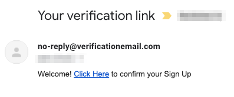
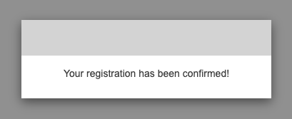

# Booster Documentation

<!-- toc -->

- [Introduction](#introduction)
  * [What is Booster?](#what-is-booster)
  * [Booster Principles](#booster-principles)
  * [Why use Booster](#why-use-booster)
- [Getting started](#getting-started)
  * [Installing Booster](#installing-booster)
    + [Prerequisites](#prerequisites)
    + [Installing the Booster CLI](#installing-the-booster-cli)
  * [Your first Booster app in 10 minutes](#your-first-booster-app-in-10-minutes)
    + [1. Create the project](#1-create-the-project)
    + [2. First command](#2-first-command)
    + [3. First event](#3-first-event)
    + [4. First entity](#4-first-entity)
    + [5. First read model](#5-first-read-model)
    + [6. Deployment](#6-deployment)
    + [7. Testing](#7-testing)
    + [8. Removing the stack](#8-removing-the-stack)
    + [9. More functionalities](#9-more-functionalities)
- [Booster architecture](#booster-architecture)
  * [1. Command and command handlers](#1-command-and-command-handlers)
    + [Commands naming convention](#commands-naming-convention)
    + [Creating a command](#creating-a-command)
    + [The command handler function](#the-command-handler-function)
    + [Authorizing a command](#authorizing-a-command)
    + [Submitting a command](#submitting-a-command)
  * [2. Events](#2-events)
    + [Events naming convention](#events-naming-convention)
    + [Creating events](#creating-events)
    + [The event store](#the-event-store)
    + [Events ordering](#events-ordering)
  * [3. Event handlers](#3-event-handlers)
    + [Creating an event handler](#creating-an-event-handler)
    + [Registering events from an event handler](#registering-events-from-an-event-handler)
    + [Reading entities from event handlers](#reading-entities-from-event-handlers)
  * [4. Entities and reducers](#4-entities-and-reducers)
    + [Entities naming convention](#entities-naming-convention)
    + [Creating entities](#creating-entities)
    + [The reducer function](#the-reducer-function)
    + [Eventual consistency](#eventual-consistency)
  * [5. Read models and projections](#5-read-models-and-projections)
    + [Read models naming convention](#read-models-naming-convention)
    + [Creating a read model](#creating-a-read-model)
    + [The projection function](#the-projection-function)
    + [Authorizing read models](#authorizing-read-models)
    + [Querying a read model](#querying-a-read-model)
    + [Getting real-time updates for a read model](#getting-real-time-updates-for-a-read-model)
- [Features](#features)
  * [IAM - Authentication and Authorization](#iam---authentication-and-authorization)
    + [Sign-up](#sign-up)
    + [Sign-in](#sign-in)
    + [Sign-out](#sign-out)
  * [GraphQL API](#graphql-api)
    + [Relationship between GraphQL operations and commands and read models](#relationship-between-graphql-operations-and-commands-and-read-models)
    + [How to send GraphQL request](#how-to-send-graphql-request)
    + [Sending commands](#sending-commands)
    + [Reading read models](#reading-read-models)
    + [Subscribing to read models](#subscribing-to-read-models)
- [Deploying](#deploying)
  * [AWS](#aws)
    + [Configure your provider credentials](#configure-your-provider-credentials)
  * [Deploy your project](#deploy-your-project)
  * [Deleting your cloud stack](#deleting-your-cloud-stack)
- [Frequently Asked Questions](#frequently-asked-questions)

<!-- tocstop -->

## Introduction

> _Progress isn't made by early risers. It's made by lazy men trying to find easier ways to do something._ — [Robert A. Heinlein](https://en.wikipedia.org/wiki/Robert_A._Heinlein)

### What is Booster?

Booster is a new kind of framework to build scalable and reliable event-driven systems faster, reimagining the software development experience to maximize your team’s speed and reduce friction on every level.

Booster follows a Domain-Driven Design approach in which you define your application in terms that are understandable by anyone in your company. From a bird’s eye view your project is organized into:

- **Commands**: Define what a user can request from the system (i.e: Add an item to the cart)
- **Events**: Simple records of facts (i.e: User X added item Y to the cart Z)
- **Entities**: Data about the things that the people in your company talk about (i.e: Orders, Customers, etc.)
- **Handlers**: Code that processes commands, reacts to events to trigger other actions, or update the entities after new events happen.

Events are the cornerstone of a Booster application, and that’s why we say that Booster is an event-driven framework. Events bring us many of the differentiating characteristics of Booster:

- **Real-time**: Events can trigger other actions when they’re created, and updates can be pushed to the connected clients without extra requests.
- **High data resiliency**: Events are stored by default in an append-only database, so the data is never lost and it’s possible to recover any previous state of the system.
- **Decoupled by nature**: Dependencies only happen at data level, so it’s easier to evolve the code without affecting other parts of the system.

Before Booster, building an event-driven system with the mentioned characteristics required huge investments in hiring engineers with the needed expertise. Booster packs this expertise, acquired from real-case scenarios in high-scale companies, into a very simple tool that handles with the hard parts for you, even provisioning the infrastructure!

We have redesigned the whole developer experience from scratch, taking advantage of the advanced TypeScript type system and Serverless technologies to go from project generation to a production-ready real-time GraphQL API that can ingest thousands of concurrent users in a matter of minutes.

Booster's ultimate goal is fulfilling the developer's dream of writing code at the application layer, in a domain-driven way that eases communications for the whole team, without caring about how anything else is done at the infrastructure level!

### Booster Principles

Booster takes a holistic and highly-opinionated approach at many levels:

- **Focus on business value**: The only code that makes sense is the code that makes your application different from any other.
- **Convention over configuration**: All the supporting code and configuration that is similar in all applications should be out of programmers’ sight.
- **Serverless-less**: Why go Serverless to avoid managing infrastructure when you can implicitly infer your Serverless architecture from your code and not even deal with that?
- **Scale smoothly**: A modern project shouldn't need to change their software architecture or rewrite their code in a different language just because they succeed and get a lot of users.
- **Event-source and CQRS**: Our world is event-driven, businesses are event-driven, and modern software maps better to reality when it’s event-driven. We have enough MVC frameworks already!
- **Principle of Abstraction**: Building an application is hard enough to have to deal with recurring low-level details like SQL, API design, or authentication mechanisms, so we tend to build more semantic abstractions on top of them.
- **Real-time first**: Client applications must be able to react to events happening in the backend and notice data changes.

### Why use Booster

Booster will fit like a glove in applications that are naturally event-driven like:

- Commerce applications (retail, e-commerce, omnichannel applications, warehouse management, etc.)
- Business management applications
- Communication systems

But it's a general-purpose framework that has several advantages over other solutions:

- **Faster time-to-market**: Booster can deploy your application to a production-ready environment from minute one, without complicated configurations or needing to invest any effort to design it. In addition to that, it features a set of code generators to help developers build the project scaffolding faster and focus on actual business code in a matter of seconds instead of dealing with complicated framework folklore.
- **Write less code**: Booster conventions and abstractions require less code to implement the same features. This not only speeds up development but combined with clear architecture guidelines also makes Booster projects easier to understand, iterate, and maintain.
- **All the advantages of Microservices, none of its cons**: Microservices are a great way to deal with code complexity, at least on paper. Services are isolated and can scale independently, and different teams can work independently, but that usually comes with a con: interfaces between services introduce huge challenges like delays, hard to solve cyclic dependencies, or deployment errors. In Booster, every handler function works as an independent microservice, it scales separately in its own lambda function, and there are no direct dependencies between them, all communication happens asynchronously via events, and all the infrastructure is compiled, type-checked and deployed atomically to avoid issues.
- **All the advantages of Serverless, without needing a degree in cloud technologies**: Serverless technologies are amazing and have made a project like Booster possible, but they're relatively new technologies, and while day after day new tools appear to make them easier, the learning curve is still quite steep. With Booster you'll take advantage of Serverless’ main selling points of high scalability and reduced hosting costs, without having to learn every detail from minute one.
- **Event-sourcing by default**: Similarly to Git repositories, Booster keeps all data changes as events indefinitely. This means that any previous state of the system can be recreated and replayed at any moment. This enables a whole world of possibilities for troubleshooting and auditing your system, or syncing development or staging environments with the production data to perform tests and simulations.
- **Booster makes it easy to build enterprise-grade applications**: Implementing an event-sourcing system from scratch is a challenging exercise that usually requires highly specialized experts. There are some technical challenges like eventual consistency, message ordering, and snapshot building. Booster takes care of all of that and more for you, lowering the curve for people that are starting and making expert lives easier.

## Getting started

### Installing Booster

You can develop with Booster using any of the following operating systems:

- Linux
- macOS
- Windows (Native and WSL)

#### Prerequisites

##### Install Node.js

The minimal required Node.js version is `v12`. Download the installer
[from nodejs website](https://nodejs.org/en/), or install it using your system's package
manager.

###### Ubuntu

```shell
curl -sL https://deb.nodesource.com/setup_14.x | sudo -E bash -
sudo apt install nodejs
```

###### macOS

```shell
brew install node
```

###### Windows

```shell
choco install nodejs
```

Verify that it was installed properly by checking so from your terminal:

```shell
$ node -v
v13.12.0

$ npm -v
6.14.4
```

As soon as you have a Node.js version higher than `v12`, and an `npm` version higher than
`6`, you are good to go. Just note that `npm` comes with node, you don't have to install
it apart.

Alternatively, we recommend you to use a version manager for dealing with different Node.js
versions:

- [`nvm`](https://github.com/nvm-sh/nvm) - Works with macOS, Linux, and Windows Subsystem
  for Linux
- [`nvm-windows`](https://github.com/coreybutler/nvm-windows) - Works with native Windows

##### Set up an AWS account

This step is optional; Booster is a cloud-native framework, meaning that your application
will be deployed to the cloud using different cloud providers. By default, Booster uses the
[AWS Provider](framework-providers-aws), so you need an AWS account. You can always omit
this step if you only want to get a grip of Booster or test it locally without making a
deployment.

Note:

> Booster is free to use, but notice that the resources deployed to your cloud provider
> might generate some expenses.
>
> In AWS, all the resources generated by Booster are part of the [AWS free tier](https://aws.amazon.com/free).
> When you're not eligible for the free tier, resources are charged on-demand. Deploying a
> Booster project and sending a few commands and queries should cost just a few cents.
>
> In any case, make sure to un-deploy your application with the command `boost nuke -e production`
> if you're not planning to keep using it.

Now it is a good time to create that AWS account, you can do so from
[the AWS console registration](https://portal.aws.amazon.com/billing/signup).

Once you've registered yourself, you have to generate an access key for Booster. To do so,
login into the [AWS Console](https://console.aws.amazon.com), and click on your account
name on the top-right corner.


A menu will open, click on **My security credentials** and it will take you to the
Identity and Access Management panel. Once there, create an access key:


A pop-up will appear, **don't close it!**. Create a folder called `.aws` under your home
folder, and a file called `credentials` with this template:

```ini
# ~/.aws/credentials
[default]
aws_access_key_id = <YOUR ACCESS KEY ID>
aws_secret_access_key = <YOUR SECRET ACCESS KEY>
```

#### Installing the Booster CLI

Booster comes with a command-line tool that helps you generating boilerplate code,
testing and deploying the application, and deleting all the resources in the cloud. All
the stable versions are published to [`npm`](https://www.npmjs.com/package/@boostercloud/cli),
these versions are the recommended ones, as they are well documented, and the changes are
stated in the release notes.

To install the Booster CLI run this:

```shell
npm install --global @boostercloud/cli
```

Verify the Booster CLI installation with the `boost version` command. You should get back
something like

```shell
$ boost version
@boostercloud/cli/0.4.1 darwin-x64 node-v13.12.0
```

### Your first Booster app in 10 minutes

In this section, we will go through all the necessary steps to have the backend up and
running for a blog application in just a few minutes. The steps to follow will be:

- [Create project](#1-create-the-project)
- [First command](#2-first-command)
- [First event](#3-first-event)
- [First entity](#4-first-entity)
- [First read model](#5-first-read-model)
- [Deployment](#6-deployment)
- [Testing](#7-testing)
  - [Creating posts](#71-creating-posts)
  - [Retrieving all posts](#72-retrieving-all-posts)
  - [Retrieving specific post](#73-retrieving-specific-post)
- [Removing stack](#8-removing-stack)
- [More functionalities](#9-more-functionalities)

#### 1. Create the project

First of all, we will use the Booster CLI to create a project. Run this command and follow
the instructions, when asked for the provider, select AWS as that is what we have
configured [here](#set-up-an-aws-account)

```shell
> boost new:project boosted-blog

...

ℹ boost new 🚧
✔ Creating project root
✔ Generating config files
✔ Installing dependencies
ℹ Project generated!
```

> Booster's new: commands follows this structure
>
> - `boost` is the Booster CLI
> - `new:<resource>` new is a CLI command, :project tells booster the kind of resource
> - `boosted-blog` is a parameter for the `new:project` command
>   project name

The `new:project` command generates some scaffolding for you. The project name will be the
project's root so `cd` into it:

```shell
cd boosted-blog
```

There you should have these files and directories already generated:

```text
boosted-blog
├── .eslintignore
├── .gitignore
├── package-lock.json
├── package.json
├── src
│   ├── commands
│   ├── common
│   ├── config
│   │   └── config.ts
│   ├── entities
│   ├── events
│   └── index.ts
└── tsconfig.json
```

Now open the project in your favorite editor, e.g. [Visual Studio Code](https://code.visualstudio.com/).

#### 2. First command

Commands define the input to our system, so we'll start by generating our first
[command](#1-command-and-command-handlers) to create posts. Use the command generator in the project's root
directory as follows:

```bash
boost new:command CreatePost --fields postId:UUID title:string content:string author:string
```

The `new:command` generator creates a `CreatePost.ts` file in the `commands` folder:

```text
boosted-blog
└── src
    └── commands
        └── CreatePost.ts
```

As we mentioned before, commands are the input of our system. they're requested
by the users, validate the input, and store one or more events, so we have to
define two more things:

1. Who is authorized to run this command.
1. And what events are being triggered when the command is executed.

Booster allows you to define authorization strategies. We will cover that
later so, let's start by allowing anyone to send this command to our application
. To do that, add the string `'all'` to the the `authorize` parameter of the
`@command` decorator. Your `CreatePost` command should look like this:

```typescript
@Command({
  authorize: 'all', // Specify authorized roles here. Use 'all' to authorize anyone
})
export class CreatePost {
  public constructor(
    readonly postId: UUID,
    readonly title: string,
    readonly content: string,
    readonly author: string
  ) {}

  public handle(register: Register): void {
    register.events(/* YOUR EVENT HERE */)
  }
}
```

#### 3. First event

Instead of storing full objects, Booster stores data in the form of events, which are
records of facts and the source of truth. We will save an event called `PostCreated`
containing the initial post info. Any change to a given `Post` will be a new event
emitted, for example, `PostUpdated`.

For now, let's emit our `PostCreated` event once we have successfully handled
our `CreatePost` command. You can generate the event with this generator:

```bash
boost new:event PostCreated --fields postId:UUID title:string content:string author:string
```

The `new:event` command generates a new file under the `src/events` directory.
The name of the file is the name of the event:

```text
boosted-blog
└── src
    └── events
        └── PostCreated.ts
```

All events in Booster must target an entity, so we need to implement an `entityID`
method. From there, We'll return the identifier of the post created, the field
`postID`. This identifier will be used by Booster later to build the final state
of the `Post` automatically. Edit the `entityID` method in `events/PostCreated.ts`
to return our `postID`:

```typescript
// src/events/PostCreated.ts

@Event
export class PostCreated {
  public constructor(
    readonly postId: UUID,
    readonly title: string,
    readonly content: string,
    readonly author: string
  ) {}

  public entityID(): UUID {
    return this.postId
  }
}
```

Now that we have an event, we can edit the `CreatePost` command to emit it. Let's change
the command's `handle` method to look like this:

```typescript
// src/commands/CreatePost.ts::handle
public handle(register: Register): void {
  register.events(new PostCreated(this.postId, this.title, this.content, this.author))
}
```

We can do any validation in the command handler before storing the event, for our
example, we'll just save the received data in a `PostCreated` event.

#### 4. First entity

So far, our `PostCreated` event suggests we need a `Post` entity. Entities are a
representation of the current state, so an Entity reduces all the events with the same
`entityID`. Let's then use the entities generator:

```bash
boost new:entity Post --fields title:string content:string author:string --reduces PostCreated
```

This time Booster has created a file called `Post.ts` in the `src/entities` directory.

The generator creates one reducer function for each kind of event. As we only have one
event yet, it will create one function. The reducer functions in Booster work similarly to
the `reduce` callback functions in Node: they receive an event and the previous state and
generate a new version of the state. When we receive a `PostCreated` event, we just return
a new `Post` copying the fields from the event:

```typescript
// src/entities/Posts.ts
@Entity
export class Post {
  public constructor(public id: UUID, readonly title: string, readonly content: string, readonly author: string) {}

  @Reduces(PostCreated)
  public static reducePostCreated(event: PostCreated, currentPost?: Post): Post {
    return new Post(event.postId, event.title, event.content, event.author)
  }
}
```

Entities represent the internal state of our system and can be queried from command or
event handlers to make business decisions or enforcing business rules.

#### 5. First read model

In a real application, we rarely want to publish our entire domain model (entities)
including all their fields. Also, different people may access one or other data depending
on their permissions. That's the goal of `ReadModels`. Client applications can query or
subscribe to them. A read model projects an entity so, let's project our `Post` and
produce a `PostReadModel`:

```bash
boost new:read-model PostReadModel --fields title:string author:string --projects Post:id
```

As you might guess, the read-model generator will generate a file called
`PostReadModel.ts` under `src/read-models`:

```text
boosted-blog
└── src
    └── read-models
        └── PostReadModel.ts
```

There are two things to do when creating a read model:

1. Define who is authorized to query or subscribe it
1. and filter out unneeded fields from the entity

Read models and commands compound the public API of a Booster application. With the
`CreatePost` command we authorized `all` to execute it, and this time we'll do the same
for the `PostReadModel`.

Just for learning, We also will exclude the `content` field from the `Post` entity so it
won't be visible.

To authorize anyone to query this read model, and filter out the content, edit the file to
look like this:

```typescript
// src/read-models/PostReadModel.ts
@ReadModel({
  authorize: 'all', // Specify authorized roles here. Use 'all' to authorize anyone
})
export class PostReadModel {
  public constructor(public id: UUID, readonly title: string, readonly author: string) {}

  @Projects(Post, 'postId')
  public static projectPost(entity: Post, currentPostReadModel?: PostReadModel): PostReadModel {
    return new PostReadModel(entity.id, entity.title, entity.author)
  }
}
```

#### 6. Deployment

At this point, we've learned:

- how to create a publicly accessible command
- we emitted an event to store the data
- we reduced the event into an entity
- and finally, we projected the entity into a read model that is also publicly accessible.

That's all; you already know the basics to build event-driven, CQRS-based applications
with Booster.

Let's deploy our application to the cloud to see it working. It is as simple as running
the deploy command:

```bash
boost deploy -e production
```

It will take a couple of minutes to deploy all the resources. Once finished, you will see
information about your stack endpoints. For this example, we will only need to pick the
API endpoint. Look into the output for something like `backend-application-stack.baseRESTURL`
e.g.

```text
https://<some random number>.execute-api.us-east-1.amazonaws.com/production/graphql
```

We are close to testing our app, and to do so, we will use the GraphQL API endpoint.
Let's address that in the next section.

#### 7. Testing

Let's get started testing the project. We will perform three actions:

- Add a couple of posts
- Retrieve all posts
- Retrieve a specific post

Booster applications provide you with a GraphQL API out of the box. Commands are
mutations, and read models are queries. To perform calls to the GraphQL API, you can use
any HTTP client you want; we recommend you to use
[Postwoman](https://postwoman.io/graphql), which is free and includes great support for
GraphQL.

##### 7.1 Creating posts

Use your favorite GraphQL client to run these mutations. No authorization header is
required since we have allowed `all` to execute our commands and query the read models.

```graphql
mutation {
  CreatePost(
    input: {
      postId: "95ddb544-4a60-439f-a0e4-c57e806f2f6e"
      title: "Build a blog in 10 minutes with Booster"
      content: "I am so excited to write my first post"
      author: "Boosted developer"
    }
  )
}
```

```graphql
mutation {
  CreatePost(
    input: {
      postId: "05670e55-fd31-490e-b585-3a0096db0412"
      title: "Booster framework rocks"
      content: "I am so excited for writing the second post"
      author: "Another boosted developer"
    }
  )
}
```

The expected response for each of those requests should be:

```json
{
  "data": {
    "CreatePost": true
  }
}
```

Note:

> In Booster, the IDs are generated on the client-side. When running production applications
> consider adding validation for ID uniqueness. For this example, we have used [a UUID generator](https://www.uuidgenerator.net/version4)

##### 7.2 Retrieving all posts

Let's perform a GraphQL `query` that will be hitting our `PostReadModel`:

```graphql
query {
  PostReadModels {
    id
    title
    author
  }
}
```

It should respond with something like:

```json
{
  "data": {
    "PostReadModels": [
      {
        "id": "05670e55-fd31-490e-b585-3a0096db0412",
        "title": "Booster framework rocks",
        "author": "Another boosted developer"
      },
      {
        "id": "95ddb544-4a60-439f-a0e4-c57e806f2f6e",
        "title": "Build a blog in 10 minutes with Booster",
        "author": "Boosted developer"
      }
    ]
  }
}
```

##### 7.3 Retrieving specific post

It is also possible to retrieve specific a `Post` by adding the `id` as input, e.g.:

```graphql
query {
  PostReadModel(id: "95ddb544-4a60-439f-a0e4-c57e806f2f6e") {
    id
    title
    author
  }
}
```

You should get a response similar to this:

```json
{
  "data": {
    "PostReadModel": {
      "id": "95ddb544-4a60-439f-a0e4-c57e806f2f6e",
      "title": "Build a blog in 10 minutes with Booster",
      "author": "Boosted developer"
    }
  }
}
```

#### 8. Removing the stack

It is convenient to destroy all the infrastructure created after you stop using
it to avoid generating cloud resource costs. Execute the following command from
the root of the project. For safety reasons, you have to confirm this action by
writing the project's name, in our case `boosted-blog` that is the same used when
we run `new:project` CLI command.

```bash
> boost nuke -e production

? Please, enter the app name to confirm deletion of all resources: boosted-blog
```

Note:

> Congratulations! You've built a serverless backend in less than 10 minutes. We hope you
> have enjoyed discovering the magic of the Booster Framework.

#### 9. More functionalities

The are many other options for your serverless backend built with Booster Framework:

- Build more complex authorization schemas for commands and read models based on user roles
- Use GraphQL subscriptions to get updates in real-time
- Make events trigger other events
- Deploy static content
- and much more...

- Authorize commands and read models based on different roles
- Use GraphQL subscriptions
- Make events to trigger other events
- Serving static content
- Reading entities within command handlers to apply domain-driven decisions
- and much more...

Continue reading to dig more; you've just scratched the surface of all the Booster
capabilities!

## Booster architecture

Two patterns influence the Booster's event-driven architecture: Command-Query Responsibility Segregation ([CQRS](https://www.martinfowler.com/bliki/CQRS.html)) and [Event Sourcing](https://martinfowler.com/eaaDev/EventSourcing.html). They're complex techniques to implement from scratch with lower-level frameworks, but Booster makes them feel natural and very easy to use.


The public interface of a Booster application is just `Commands` and `ReadModels`. Booster proposes an entirely different approach to the Model-View-\* and CRUD frameworks. With Booster, the clients submit commands, query the read models, or subscribe to them for receiving real-time updates thanks to the out of the box [GraphQL API](#graphql-api)

Booster applications are event-driven and event-sourced so, **the source of truth is the whole history of events**. When a client submits a command, the `CommandHandler` _wakes up_ and executes its logic. Optionally, it can _register_ as many `Events` as needed. The framework caches the current state by automatically _reducing_ all the registered events into `Entities`. Interested parties can _react_ to events via `EventHandlers`, and finally, the _projection_ functions transform the entities into `ReadModels`.

In this chapter you'll walk through these concepts and its details.

### 1. Command and command handlers

Booster is different than MVC frameworks in which you typically implement controller classes with the five CRUD methods per model. Instead of that, you define commands, which are the user actions when interacting with an application. This approach fits very well with Domain-Driven Design. Depending on your application's domain, some examples of commands would be: `RemoveItemFromCart`, `RatePhoto`, `AddCommentToPost`, etc. Although, you can still have `Create*`, `Delete*`, or `Update*` commands when they make sense.

There is an architectural splitting between commands and command handlers though they *live* under the same file. The command is the class with the `@Command` decorator, and the generated method called `handle` is the command handler. That is because Booster adopts several concepts from functional programming; the separation between data structures and data transformations is one of them. In Booster a command looks like this:

```typescript
@Command({
  authorize: 'all' | Array<RoleClass>
})
export class CommandName {
  public constructor(
    readonly fieldA: SomeType,
    readonly fieldB: SomeOtherType,
    /* as many fields as needed */
  ) {}

  public async handle(register: Register): Promise<void> {
    // Validate inputs
    // Run domain logic
    // register.events([event1,...])
  }
}
```

Every time you submit a command through the GraphQL API, Booster calls the command handler function for the given command. The Commands are part of the public API so that you can define authorization policies for them. They are also the place for validating input data before registering events into the event store because they are immutable once there.

#### Commands naming convention

Semantic is very important in Booster as it will play an essential role in designing a coherent system. Your application should reflect your domain concepts, and commands are not an exception. Although you can name commands in any way you want, we strongly recommend you to name them starting with verbs in imperative plus the object being affected. If we were designing an e-commerce application, some commands would be:

- CreateProduct
- DeleteProduct
- UpdateProduct
- ChangeCartItems
- ConfirmPayment
- MoveStock
- UpdateCartShippingAddress

Despite you can place commands, and other Booster files, in any directory, we strongly recommend you to put them here `project-root/src/commands`. Having all the commands in one place will help you to understand your application's capabilities at a glance.

```text
project-root
├── src
│   ├── commands <------ They should be here
│   ├── common
│   ├── config
│   ├── entities
│   ├── events
│   ├── index.ts
│   └── read-models
```

#### Creating a command

The preferred way to create a command is by using the generator, e.g.

```shell
boost new:command CreateProduct --fields sku:SKU displayName:string description:string price:Money
```

The generator will automatically create a file called `CreateProduct.ts` with a TypeScript class of the same name under the commands directory. You can still create the command manually. Since the generator is not doing any *magic*, all you need is a class decorated as `@Command`. Anyway, we recommend you always to use the generator, because it handles the boilerplate code for you.

Note:
> Running the command generator with a `CommandName` already existing, will override the content of the current one. Soon, we will display a warning before overwriting anything. Meantime, if you missed a field, just add it to the class because in Booster, all the infrastructure and data structures are inferred from your code.

#### The command handler function

Booster generates the command handler function as a method of the command class. This function is called by the framework every time that one instance of this command is submitted. The command handler the right place to run validations, return errors, query entities to make decisions and register relevant domain events.

##### Validating data

Booster uses the typed nature of GraphQL to ensure that types are correct before reaching the handler, so you don't have to validate types.

###### Throw an error

There are still business rules to be checked before proceeding with a command. For example, a given number must be between a threshold or a string must match a regular expression. In that case, it is enough just to throw an error in the handler, and then Booster will use the error's message as the response to make it descriptive, e.g.

Given this command:

```typescript
@Command({
  authorize: 'all',
})
export class CreateProduct {
  public constructor(
    readonly sku: string,
    readonly price: number
  ) {}

  public async handle(register: Register): Promise<void> {
    const priceLimit = 10
    if (this.price >= priceLimit) {
      throw new Error(`price must be below ${priceLimit}, and it was ${this.price}`)
    }
  }
}

```

And this mutation:

```graphql
mutation($input: CreateProductInput!) {
  CreateProduct(input: $input)
}

# Variables

{
  "input": {
    "sku": "MYSKU",
    "price": 19.99
  }
}
```

You'll get something like this response:

```grapqhl
{
  "errors": [
    {
      "message": "price must be below 10, and it was 19.99",
      "path": [
        "CreateProduct"
      ]
    }
  ]
}
```

###### Register error events 

There could be situations in which you want to register an event representing an error. For example, when moving items with insufficient stock from one location to another:

```typescript
@Command({
  authorize: [Admin],
})
export class MoveStock {
  public constructor(
    readonly productID: string,
    readonly origin: string,
    readonly destination: string,
    readonly quantity: number
  ) {}

  public async handle(register: Register): Promise<void> {
    if (!this.enoughStock(this.productID, this.origin, this.quantity)) {
      register.events(new ErrorEvent(`There is not enough stock for ${this.productID} at ${this.origin}`))
    } else {
      register.events(new StockMoved(/*...*/))
    }
  }

  private enoughStock(productID: string, origin: string, quantity: number): boolean {
    /* ... */
  }
}
```

In this case, the client who submitted the command can still complete the operation. Then an event handler will take care of that `ErrorEvent` and proceed accordingly.

##### Reading entities

Event handlers are a good place to make decisions, and for making better decisions, you need information. There is a Booster function called `fetchEntitySnapshots` within the `Booster` package and allows you to inspect the application state. This function receives two arguments, the `Entity` to fetch and the `entityID`. Here is an example of fetching an entity called `Stock`:

```typescript
@Command({
  authorize: [Admin],
})
export class MoveStock {
  public constructor(
    readonly productID: string,
    readonly origin: string,
    readonly destination: string,
    readonly quantity: number
  ) {}

  public async handle(register: Register): Promise<void> {
    const stock = await Booster.fetchEntitySnapshot(Stock, this.productID)
    if (!this.enoughStock(this.origin, this.quantity, stock)) {
      register.events(new ErrorEvent(`There is not enough stock for ${this.productID} at ${this.origin}`))
    }
  }

  private enoughStock(origin: string, quantity: number, stock?: Stock): boolean {
    const count = stock?.countByLocation[origin]
    return !!count && count >= quantity
  }}
```

##### Registering events

Within the command handler execution, it is possible to register domain events. The command handler function receives the `register` argument, so within the handler, it is possible to call `register.events(...)` with a list of events. For more details about events and the register parameter, see the [`Events`](#2-events) section.

#### Authorizing a command

Commands are part of the public API of a Booster application, so you can define who is authorized to submit them. The Booster authorization feature is covered in [this](#iam-authentication-and-authorization) section. So far, we have seen that you can make a command publicly accessible by authorizing `'all'` to submit it. You can also set specific roles as we did with the `authorize: [Admin]` parameter of the `MoveStock` command.

#### Submitting a command

Booster commands are accessible to the outside world as GraphQL mutations. GrahpQL fits very well with Booster's CQRS approach because it has two kinds of operations: Mutations and Queries. Mutations are actions that modify the server-side data, as the commands are.

Booster automatically creates one mutation per command. The framework infers the mutation input type from the command fields, e.g., given this `CreateProduct` command:

```typescript
@Command({
  authorize: 'all',
})
export class CreateProduct {
  public constructor(
    readonly sku: Sku,
    readonly displayName: string,
    readonly description: string,
    readonly price: number
  ) {}

  public async handle(register: Register): Promise<void> {
    register.events(/* YOUR EVENT HERE */)
  }
}
```

Booster generates this GraphQL mutation:

```text
mutation CreateProduct($input: CreateProductInput!): Boolean
```

where the schema for `CreateProductInput` is 

```text
{
  sku: String
  displayName: String
  description: String
  price: Float
}
```

### 2. Events

Events are **immutable facts** within your application's domain. They are the cornerstone in Booster because of its event-driven and event-sourced nature. Booster events are TypeScript classes decorated with `@Event `:

```typescript
@Event
export class EventName {
  public constructor(readonly field1: SomeType,
                     readonly field2: SomeOtherType,
                     /*as many fields as you needed*/) {}

  public entityID(): UUID {
    return /* the associated entity ID */
  }
}
```

All the event classes must implement an `entityID` method, returning the ID of the entity they are tied to. This id will be used later for building up the application's state via [entities](#entities-and-reducers). In most situations, you can reduce the event stream to an entity like a Cart. However, in some use cases, the event stream relates to a specific entity without reducing it. For example, a register of sensor values in a weather station; in that case, the station has no specific value to be reduced. You can implement the semantics that best suits your needs.

#### Events naming convention

As with commands, you can name events in any way you want, depending on your application's domain. Though, we recommend you to chose short sentences written in past tense because events are facts that have happened and can't be changed. Some event names would be:

- ProductCreated
- ProductUpdated
- ProductDeleted
- CartItemChanged
- StockMoved

As with other Booster files, events have their directory:

```text
project-root
├── src
│   ├── commands
│   ├── common
│   ├── config
│   ├── entities
│   ├── events <------ They must be here
│   ├── index.ts
│   └── read-models
```

#### Creating events

The preferred way to create event files is the `new:event` generator, e.g.

```shell
boost new:event StockMoved --fields productID:string origin:string destination:string quantity:number
```

That will generate a file called `StockMoved.ts` under the proper `project-root/src/events` directory. You can also create the file manually, but we recommend using the generator and avoid dealing manually with boilerplate code.

Note:

> Running the event generator with an EventName already existing, will override the content of the current one. Soon, we will display a warning before overwriting anything. Meantime, if you missed a field, just add it to the class because, in Booster, all the infrastructure and data structures are inferred from your code.

#### Registering events and the event store

Creating an event file is different than storing an event instance in the event store. Booster calls The last `registering` an event. As said before, Booster applications are event-sourced, which means that all the events are stored forever. Think that all events go to a kind of event store, the store is a log queried by the [reducer functions](#4-entities-and-reducers) to recreate the application's current state.

Booster injects the register as a parameter in the `handle` method of both the command and the event handlers. Then, registering an event is as simple as calling this function `register.events([event1, event2, ...])`, e.g.

##### Registering events from command handlers

```typescript
@Command({
  authorize: [Admin],
})
export class MoveStock {
  public constructor(
    readonly productID: string,
    readonly origin: string,
    readonly destination: string,
    readonly quantity: number
  ) {}

  public async handle(register: Register): Promise<void> {
    if (!this.enoughStock(this.origin, this.quantity, this.productID)) {
      register.events(new ErrorEvent(`There is not enough stock for ${this.productID} at ${this.origin}`))
    }
  }
}
```

##### Registering events from event handlers

In the case of the event handlers, you also receive the event instance that triggered the handle function.

```typescript
@EventHandler(StockMoved)
export class HandleAvailability {
  public static async handle(event: StockMoved, register: Register): Promise<void> {
    if (event.origin == 'provider') {
      register.events(new ProductAvailabilityChanged(event.productID, event.quantity))
    } else if (event.destination == 'customer') {
      register.events(new ProductAvailabilityChanged(event.productID, -event.quantity))
    }
  }
}
```

#### Events ordering

<!-- TODO: several people have asked about how Booster ensures event ordering. I think it makes sense to explain that here  -->

### 3. Event handlers

In event-driven architectures we have different parts of our application that react to events, one of them is the `@Entity`, in charge of reducing the event. But we also have event handlers, a class with the `@EventHandler` decorator. The event handlers also react to events, and are used when you want to trigger new events based on the original one.

An event handler would look like this:

```typescript
@EventHandler(StockMoved)
export class HandleAvailability {
  public static async handle(event: StockMoved, register: Register): Promise<void> {
    if (event.origin == 'provider') {
      // New stock enters the system
      register.events(new ProductAvailabilityChanged(event.productID, event.quantity))
    } else if (event.destination == 'customer') {
      // Stock goes to the customer
      register.events(new ProductAvailabilityChanged(event.productID, -event.quantity))
    }
    // In terms of availability, it doesn't matter in which warehouse the stock is as soon as there's stock
  }
}
```

#### Creating an event handler

Event handlers can be easily created using the Booster CLI. There are two compulsory arguments that will need to be provided following the `boost new:event-handler` command, the first one will be the event handler name, and the other will be the name of the event that it will react to. For instance:

```typescript
boost new:event-handler HandleAvailability -e StockMoved
```

The flag `-e` can be replaced by `--event`.

Once the creation is completed, there will be a new file in the event handlers directory `project-root/src/event-handlers/HandleAvailability.ts`.

```text
project-root
├── src
│   ├── commands
│   ├── common
│   ├── config
│   ├── entities
│   ├── events
│   ├── event-handlers <------ They must be here
│   ├── index.ts
│   └── read-models
```

#### Registering events from an event handler

By default, your newly created event handler will not trigger any event. However, Booster injects in our handler a `register` instance that we can use to do so. In the above example, you could see that there is some logic based on the event information.

The `events` method of the `register` allows triggering several events, you can specify as many as you need separated by commas as arguments of the function.

An example can be found below:

```typescript
register.events(new ProductAvailabilityChanged(event.productID, -event.quantity))
```

#### Reading entities from event handlers

Event handlers are also a good place to retrieve entity information before triggering new events.

Let's say that we want to check the status of a product before we trigger its availability update. In that case we would call the `Booster core` `fetchEntitySnapshot` function, which will return information about the entity.

```typescript
public static async handle(event: StockMoved, register: Register): Promise<void> {
  const productSnapshot = await Booster.fetchEntitySnapshot(Product, event.productID)
  ...
}
```

### 4. Entities and reducers

The source of truth of your Booster app are the events, but events make sense in the context of a domain entity.
For example, in a banking app, there might be two events: `MoneyDeposited` and `MoneyWithdrawn`. But these events
only make sense in the context of a `BankAccount`.

Entities are created on the fly, by _reducing_ the whole event stream. You shouldn't assume that they are stored anywhere. However, Booster
does create automatic snapshots to make the reduction process efficient. You are the one in charge of writing the
reducer function.

An entity is defined as a class with the `@Entity` decorator. Inside of it, you can write one or more static methods with
the `@Reduces` decorator that defines the name of the event class that the reducer is subscribed to. The reducer method is called once every time that one event of that type is registered in the event store, and Booster expects you to return how the entity ends up after the event has been applied. An entity class looks like this:

```typescript
@Entity
export class EntityName {
  public constructor(readonly fieldA: SomeType, readonly fieldB: SomeOtherType /* as many fields as needed */) {}

  @Reduces(SomeEvent)
  public static reduceSomeEvent(event: SomeEvent, previousState?: EntityName): EntityName {
    /* Return a new entity based on the previous one */
  }
}
```

Each time an event is registered, the reducer of its entity is triggered. Note that event ordering is
preserved per entity instance. This means that one entity will receive just **one event each time**, and all other events of any kind that belong to the same entity will be waiting in a queue until the previous reducer has finished. This is important to make sure that entities state can be easily predicted even when events are being generated concurrently all over the place. It's also one of the reasons why we recommend to keep reducer functions simple and pure: with no side effects or external data gathering.
be picked will be the one that was generated first.

#### Entities naming convention

Entities are a representation of your application state in a specific moment, so name them as closely to your domain objects as possible. Typical entity names are nouns that
might appear when you think about your app. In an e-commerce application, some entities would be:

- Cart
- Product
- UserProfile
- Order
- Address
- PaymentMethod
- Stock

Entities live within the entities directory of the project source: `project-root/src/entities`.

```text
project-root
├── src
│   ├── commands
│   ├── common
│   ├── config
│   ├── entities <------ put them here
│   ├── events
│   ├── index.ts
│   └── read-models
```

#### Creating entities

The preferred way to create an entity is by using the generator, e.g.

```text
boost new:entity Product --fields displayName:string description:string price:Money
```

The generator will automatically create a file called `Product.ts` with a TypeScript class of the same name under the entities directory. You can still create the entity manually. Since the generator is not doing any magic, all you need is a class decorated as `@Command`. Anyway, we recommend you always to use the generator, because it handles the boilerplate code for you.

Note:

> Running the entity generator with an EntityName that already exists will overwrite the content of the current one. In future releases, we will display a warning before overwriting anything. Meantime, if you missed a field, just add it to the class because, in Booster, all the infrastructure and data structures are inferred from your code.

#### The reducer function

Booster generates the reducer function as a static method of the entity class. That function is called by the framework every time that an event of the
specified type is emitted. It's highly recommended to **keep your reducer functions pure**, which means that you should be able to produce the new entity version by just looking at the event and the previous entity state (which are both injected via parameter by the framework). You should avoid calling third party services, reading or writing to a database, or changing any external state.

Booster injects two parameters to the reducer functions:

- `event` - The event object that triggered the reducer
- `currentEntity?` - The current state of the entity instance that the event belongs to if it exists. **This parameter is optional** and will be `undefined` if the entity don't exist yet (For example, when you process a `ProductCreated` event that will generate the first version of a `Product` entity).

This is how events change your application state.

Given this entity:

```ts
@Entity
export class Cart {
  public constructor(public id: UUID, readonly items: Array<CartItem>) {}

  @Reduces(ProductAdded)
  public static reduceProductAdded(event: ProductAdded, currentCart?: Cart): Cart {
    const newItems = addToCart(event.item, currentCart)
    return new Cart(event.cartID, newItems)
  }

  @Reduces(ProductRemoved)
  public static reduceProductRemoved(event: ProductRemoved, currentCart?: Cart): Cart {
    const newItems = removeFromCart(event.item, currentCart)
    return new Cart(event.cartID, newItems)
  }
}
```

You can visualize reduction like this:


#### Eventual consistency

Due to the event driven and async nature of Booster, your data might
not be instantly updated. Booster will consume the commands,
generate events, and _eventually_ generate the entities. Most of the
time this is not perceivable, but under huge loads, it could be noticed.

This property is called [Eventual Consistency](https://en.wikipedia.org/wiki/Eventual_consistency), and it is a trade-off to have high availability for
extreme situations, where other systems might simply fail.

### 5. Read models and projections
Read Models are cached data optimized for read operations and they're updated reactively when [Entities](#4-entities-and-reducers) are updated by new [events](#2-events). They also define the *Read* API, the available REST endpoints and their structure.

Read Models are classes decorated with the `@ReadModel` decorator that have one or more projection methods.

```typescript
@ReadModel
export class CartReadModel {
  public constructor(
    readonly id: UUID,
    readonly cartItems: Array<CartItem>,
    public paid: boolean
  ) {}

  @Projection(Cart, 'id')
  public static updateWithCart(cart: Cart, oldCartReadModel?: CartReadModel): CartReadModel {
    return new CartReadModel(cart.id, cart.cartItems, cart.paid)
  }
}
```

#### Read models naming convention

#### Creating a read model
```shell
boost new:read-model CartReadModel --fields id:UUID cartItems:"Array<CartItem>" paid:boolean --projects Cart
```

This will create a file in the read-models directory `project-root/src/read-models/CartReadModel.ts`.

Read Model classes can also be created by hand and there are no restrictions regarding the place you put the files. The structure of the data is totally open and can be as complex as you can manage in your projection functions.

#### The projection function
A `Projection` is a method decorated with the `@Projection` decorator that, given a new entity value and (optionally) a previous read model state, generate a new read model value.

Read models can be projected from multiple [entities](#4-entities-and-reducers) as soon as they share some common key called `joinKey`.

#### Authorizing read models

#### Querying a read model
You can use the GraphQL endpoint to query or subscribe to the read model records: [see the API documentation](#GraphQL-API).

#### Getting real-time updates for a read model

## Features

### IAM - Authentication and Authorization
Authorization in Booster is done through roles. Every Command and ReadModel has an `authorize` policy that
tells Booster who can execute or access it. It consists of one of the following two values:

- `'all'`: Meaning that the command is public: any user, both authenticated and anonymous, can execute it.
- An array of authorized roles `[Role1, Role2, ...]`: This means that only those authenticated users that
  have any of the roles listed there are authorized to execute the command

> For example, the following command can be executed by anyone:

```typescript
@Command({
  authorize: 'all',
})
export class CreateComment {
  ...
}
```

> While this one can be executed by authenticated users that have the role `Admin` or `User`:

```typescript
@Command({
  authorize: [Admin, User],
})
export class UpdateUser {
  ...
}
```

By default, a Booster application has no roles defined, so the only allowed value you can use in the `authorize` policy is `'all'` (good for public APIs).
If you want to add user authorization, you first need to create the roles that are suitable for your application.
Roles are classes annotated with the `@Role` decorator, where you can specify some attributes.

> Example definition of roles `Admin` and `User`:

```typescript
@Role({
  allowSelfSignUp: false,
})
export class Admin {}

@Role({
  allowSelfSignUp: true,
})
export class User {}
```

Here, we have defined the `Admin` and `User` roles. The former contains the following attribute `allowSelfSignUp: false`,
which means that when users sign-up, they can't specify the role `Admin` as one of its roles.
The latter has this attribute set to `true`, which means that any user can self-assign the role `User` when signing up.

If your Booster application has roles defined, an authentication API will be provisioned. It will allow your users to gain
access to your resources.

Once a user has an access token, it can be included in any request made to your Booster application as a
Bearer Authorization header (`Authorization: Bearer`). It will be used to get the user information and
authorize it to access protected resources.

#### Sign-up
Users can use this endpoint to register in your application and get some roles assigned to them.
Only roles with the attribute `allowSelfSignUp: true` can be specified upon sign-up. After calling this endpoint, the
registration is not yet finished. Users need to confirm their emails by clicking in the link that will be sent to their 
inbox.




##### Endpoint
```http request
POST https://<httpURL>/auth/sign-up
```
##### Request body
```json
{
  "clientId": "string",
  "username": "string",
  "password": "string",
  "userAttributes": {
   	"roles": ["string"]
  }
}
```

Parameter | Description
--------- | -----------
_clientId_ | The application client Id that you got as an output when the application was deployed.
_username_ | The username of the user you want to register. It **must be an email**.
_password_ | The password the user will use to later login into your application and get access tokens.
_userAttributes_ | Here you can specify the attributes of your user. These are: <br/> -_**roles**_:  An array of roles this user will have. You can only specify here roles with the property `allowSelfSignUp = true`


##### Response
An Empty Body

##### Errors
> Sign-up error response body example: Not specifying an email as username.

```json
{
  "__type": "InvalidParameterException",
  "message": "Username should be an email."
}
```

You will get an HTTP status code different from 2XX and a body with a message telling you the reason of the error.

#### Sign-in
This endpoint creates a session for an already registered user, returning an access token that can be used
to access role-protected resources

##### Endpoint
```http request
POST https://<httpURL>/auth/sign-in
```
##### Request body
```json
{
  "clientId": "string",
  "username": "string",
  "password": "string"
}
```
Parameter | Description
--------- | -----------
_clientId_ | The application client Id that you got as an output when the application was deployed.
_username_ | The username of the user you want to sign in. They must have previously signed up.
_password_ | The password used to sign up the user.

##### Response
```json
{
  "accessToken": "string",
  "expiresIn": "string",
  "refreshToken": "string",
  "tokenType": "string"
}
```

Parameter | Description
--------- | -----------
_accessToken_ | The token you can use to access restricted resources. It must be sent in the `Authorization` header (prefixed with the `tokenType`).
_expiresIn_ | The period of time, in seconds, after which the token will expire.
_refreshToken_ | The token you can use to get a new access token after it has expired.
_tokenType_ | The type of token used. It is always `Bearer`.

##### Errors
> Sign-in error response body example: Login of an user that has not been confirmed

```json
{
  "__type": "UserNotConfirmedException",
  "message": "User is not confirmed."
}
```

You will get a HTTP status code different from 2XX and a body with a message telling you the reason of the error.

#### Sign-out
Users can call this endpoint to finish the session.

##### Endpoint
```http request
POST https://<httpURL>/auth/sign-out
```
##### Request body
> Sign-out request body
```json
{
  "accessToken": "string"
}
```

Parameter | Description
--------- | -----------
_accessToken_ | The access token you get in the sign-in call.

##### Response
An empty body

##### Errors
> Sign-out error response body example: Invalid access token specified
```json
{
  "__type": "NotAuthorizedException",
  "message": "Invalid Access Token"
}
```
You will get a HTTP status code different from 2XX and a body with a message telling you the reason of the error.

### GraphQL API
This is the main API of your application, as it allows you to:

 - _Modify_ data by **sending commands**
 - _Read_ data by **querying read models**
 - _Receive data in real time_ by **subscribing to read models** 
 
All this is done through [GraphQL](https://graphql.org/), a query language for APIs that has useful advantages over simple REST APIs.

If you are not familiar with GraphQL, then, first of all, don't worry! 
_Using_ a GraphQL API is simple and straightforward.
_Implementing it_ on the server side is the hardest part, as you need to define your schema, operation, resolvers, etc.
Luckily, you can forget about that because it is already done by Booster.
 
The GraphQL API is fully **auto-generated** based on your _commands_ and _read models_.

#### Relationship between GraphQL operations and commands and read models
GraphQL defines three kinds of operations that you can use: _mutations_, _queries_, and _subscriptions_. 

The names are pretty meaningful, but we can say that you use a `mutation` when you want to change data, a `query` when you want to get
data on-demand, and a `subscription` when you want to receive data at the moment it is updated.

Knowing this, you can infer the relationship between those operations and your Booster components:

- You _send_ a **command** using a **mutation**
- You _read_ a **read model** using a **query**
- You _subscribe_ to a **read model** using a **subscription** 

#### How to send GraphQL request
GraphQL uses two existing protocols: 

- _HTTP_ for `mutation` and `query` operations
- _WebSocket_ for `subscription` operations

The reason for the WebSocket protocol is that, in order for subscriptions to work, there must be a way for the server to send data
to clients when it is changed. HTTP doesn't allow that, as it is the client the one which always initiates the request.
 
This is the reason why Booster provisions two main URLs: the **httpURL** and the **websocketURL** (you can see them after
deploying your application). You need to use the "httpURL" to send GraphQL queries and mutations, and the "websocketURL"
to send subscriptions.

Therefore:

- To send a GraphQL mutation/query, you send an HTTP request to _"<httpURL>/graphql"_, with _method POST_, and a _JSON-encoded body_ with the mutation/query deatils.
- To send a GraphQL subscription, you first connect to the _websocketURL_, and then send a _JSON-encoded message_ with the subscription details.

Check the following section for details and examples.

You normally don't need to deal with this low-level details. There are plenty of GraphQL clients for sending request manually
(like [Postwoman](https://postwoman.io/)) or libraries you can use in the client-side of your application
(like [Apollo](https://www.apollographql.com/))

#### Sending commands

As mentioned in the previous section, we need to use a "mutation" to send a command. The structure of a mutation (the body
of the request) is the following:

```graphql
mutation {
  command_name(input: {
    input_field_list
  })
}
```

Where:
- _**command_name**_ is the name of the class corresponding to the command you want to send
- _**field_list**_ is list of pairs in the form of `fieldName: fieldValue` containing the data of your command. The field names
correspond to the names of the properties you defined in the command class. 

Check the examples where we send a command named "ChangeCart" that will add/remove an item to/from a shopping cart. The 
command requires the ID of the cart (`cartId`), the item identifier (`sku`) and the quantity of units we are adding/removing
(`quantity`).

Remember that in case you want to send a command that is restricted to a specific set of roles, you must send the **access token**
in the **"Authorization"** header: *"Authorization: Bearer &lt;token retrieved upon sign-in&gt;"*

> Using a GraphQL-specific client:

```
URL: "<httpURL>/graphql"
```
```graphql
mutation {
  ChangeCart(input: {
    cartId: "demo"
    sku: "ABC_01"
    quantity: 2
  })
}
```

> Equivalent bare HTTP request:

```
URL: "<httpURL>/graphql"
METHOD: "POST"
```
```json
{
  "query":"mutation { ChangeCart(input: { cartId: \"demo\" sku: \"ABC_01\" quantity: 2 }) }"
}
```

> Response:
```json
{
  "data": {
    "ChangeCart": true
  }
}
```

#### Reading read models

To read a specific read model, we need to use a "query" operation. The structure of the "query" (the body
of the request) is the following:

```graphql
query {
  read_model_name(id: "<id of the read model>") {
    selection_field_list
  }
}
```

Where:
- _read_model_name_ is the name of the class corresponding to the read model you want to retrieve.
- _&lt;id of the read model&gt;_ is the ID of the specific read model instance you are interested in.
- _selection_field_list_ is a list with the names of the specific read model fields you want to get as response.

Check the examples where we send a query to read a read model named "CartReadModel" whose ID is "demo" and we get back as
response its `id` and the list of cart `items`

Remember that in case you want to query a read model that is restricted to a specific set of roles, you must send the **access token**
in the **"Authorization"** header: *"Authorization: Bearer &lt;token retrieved upon sign-in&gt;"*

> Using a GraphQL-specific client:

```
URL: "<httpURL>/graphql"
```
```graphql
query {
  CartReadModel(id: "demo") {
    id
    items
  }
}
```

> Equivalent bare HTTP request:

```
URL: "<httpURL>/graphql"
METHOD: "POST"
```
```json
{
  "query":"query { CartReadModel(id: \"demo\") { id items } }"
}
```

> Response

```json
{
  "data": {
    "CartReadModel": {
      "id": "demo",
      "items": [
        {
          "sku": "ABC_01",
          "quantity": 2
        }
      ]
    }
  }
}
```

#### Subscribing to read models

To subscribe to a specific read model, we need to use a "subscription" operation, and it must be _sent through the **websocketURL**_.


Before sending any subscription, you need to _connect_ to the web socket to open the two-way communication channel. This connection
is done differently depending on the client/library you use to manage web sockets. In this section, we will show examples 
using the ["wscat"](https://github.com/websockets/wscat) command line program. 

Once you have connected successfully, you can use this channel to:
- Send the subscription messages
- Listen for messages sent by the server with data corresponding to your active subscriptions. 

The structure of the "subscription" (the body of the message) is exactly the same as the "query" operation:

```graphql
subscription {
  read_model_name(id: "<id of the read model>") {
    selection_field_list
  }
}
```

Where:
- _read_model_name_ is the name of the class corresponding to the read model you want to subscribe to.
- _&lt;id of the read model&gt;_ is the ID of the specific read model instance you are interested in.
- _selection_field_list_ is a list with the names of the specific read model fields you want to get when data is sent back to you.

In the following examples we use ["wscat"](https://github.com/websockets/wscat) to connect to the web socket and send a subscription
to the read model `CartReadModel` with ID "demo"

Remember that in case you want to subscribe to a read model that is restricted to a specific set of roles, you must send, 
in the *connection operation*, the **access token** in the **"Authorization"** header: 
*"Authorization: Bearer &lt;token retrieved upon sign-in&gt;"*

> Connecting to the web socket:

```sh
 wscat -c <websocketURL>
```

> Sending a message with the subscription

```json
{"query": "subscription { CartReadModel(id:\"demo\") { id items } }" }
```

After a successful subscription, you won't receive anything in return. Now, every time the read model you subscribed to
is modified, a new incoming message will appear in the socket with the updated version of the read model. This message
will have exactly the same format as if you were done a query with the same parameters.

Following the previous example, we now send a command (using a "mutation" operation) that adds
a new item with sku "ABC_02" to the `CartReadModel`. After it has been added, we receive the updated version of the read model through the
socket.

> Send the Command

```
URL: "<httpURL>/graphql"
```
```graphql
mutation {
  ChangeCart(input: {
    cartId: "demo"
    sku: "ABC_02"
    quantity: 3
  })
}
```

> The following message appears in the socket

```json
{
  "data": {
    "CartReadModel": {
      "id": "demo",
      "items": [
        {
          "sku": "ABC_01",
          "quantity": 2
        },
        {
          "sku": "ABC_02",
          "quantity": 3
        }
      ]
    }
  }
}
```

## Deploying

One of the goals of Booster is to become provider agnostic so you can deploy your application to any serverless provider like AWS, Google Cloud, Azure, etc...

So far, in the current version, only AWS is supported, but given the high level of abstraction, it will eventually support
all cloud providers. (**Contributions are welcome!** 😜)

### AWS

#### Configure your provider credentials
> Creating a plain text file manually named `~/.aws/credentials` with the following content will be enough:

```text
[default]
aws_access_key_id = <YOUR KEY ID>
aws_secret_access_key = <YOUR ACCESS KEY>
region = eu-west-1
```

In AWS, it is required that your `~/.aws/credentials` are properly setup, and a `region` attribute is specified. If you have the [AWS CLI installed](https://docs.aws.amazon.com/cli/latest/userguide/cli-chap-install.html), you can create the config file by running the command `aws configure`, but that is completely optional, **AWS CLI is not required to run booster**. 

It's recomended to use IAM user keys and avoiding your root access keys. If you need help obtaining a `KEY ID` and `ACCESS KEY`, [check out the oficial AWS guides](https://docs.aws.amazon.com/IAM/latest/UserGuide/id_credentials_access-keys.html#Using_CreateAccessKey).

### Deploy your project

To deploy your Booster project, run the following command:

```shell
boost deploy -e production
```

It will take a while, but you should have your project deployed to your cloud provider.

If you make changes to your code, you can run `boost deploy -e production` again to update your project in the cloud.

### Deleting your cloud stack

If you want to delete the Booster application that has been deployed to the cloud, you can run:

```shell
boost nuke -e production
```

**Note**: This will delete everything in your stack, including databases. This action is **not** reversible!

## Frequently Asked Questions
**1.- When deploying my application in AWS for the first time, I got an error saying _"StagingBucket <your app name>-toolkit-bucket already exists"_**
  
When you deploy a Booster application to AWS, an S3 bucket needs to be created to upload the application code. Booster names that bucket
using your application name as a prefix. 
In AWS, bucket names must be unique _globally_, so if there is another bucket in the world with exactly the same name as
the one generated for your application, you will get this error.  

The solution is to change your application name in the configuration file so that the bucket name is unique.
